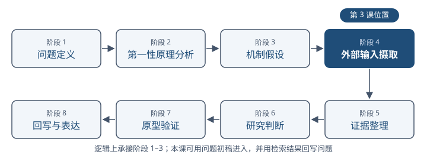
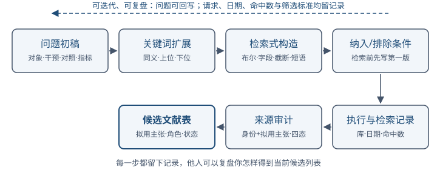
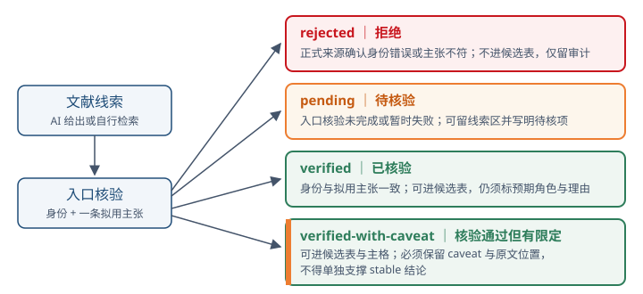
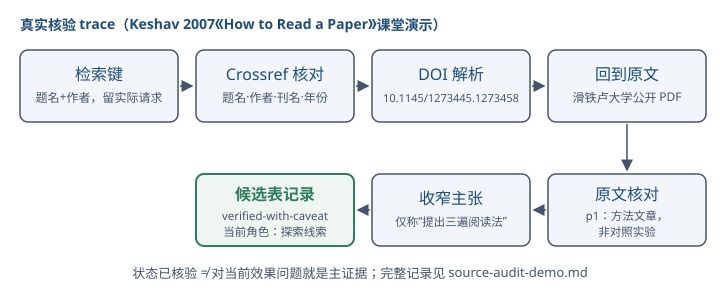

---
版本：v1.3.0
最后更新：2026-08-09
适用课次：第 3 课
文档类型：学生正式讲义
状态：现行
变更记录：
- v1.3.0 (2026-08-09): 新增 §六"检索质量自评"（基准集法、滚雪球与饱和、分支覆盖矩阵、代表性五项检查与记录要求）；原 §六-§十 顺延为 §七-§十一；术语表增补基准集、滚雪球核验、饱和三项；新节定位为检索完成后的持续自评清单，学习目标与 90 分钟课堂结构不变
- v1.2.0 (2026-08-09): 区分预期证据角色、核验状态与筛选决定；将 L3 核验边界收束为“身份+一条拟用主张”入口核验，与 L4 深度精读分工；统一检索、筛选、审计和候选表字段及项目落点
- v1.1.0 (2026-08-08): 2.0 批次 0 骨架轮——首次嵌入 4 张自绘结构图（§一/§二/§四·3/§四·4）并各附出处块；G5 防御性文本清理（基线 26 处→清理后 20 处，削减 6 处；保留必要边界 15 处、事实性判定 3 处、对仗点睛 2 处，清单见课次 README 修订轮登记）；学习目标与时间结构未动；MI 演示线推迟到素材到位
- v1.0.0 (2026-08-07): 完成内容复核；统一四态与候选表/证据主格进入规则；增加 Keshav 2007 真实 Crossref—DOI—原文 trace；将 27 分钟最低产出收缩为 1 条检索记录、2 条审计、1 条已核验候选记录和 1 条 AI 记录
- v0.1.0 (2026-08-06): 从零起草；定位阶段四"外部输入摄取"；建立检索式构建、证据角色区分、AI 检索结果回原文核验、练习、术语与延伸阅读
---

# 第三讲｜文献检索与证据角色

## 导读

第 1 课指出 AI 可以参与几乎所有科研动作，但"完整产物"不等于"科研成立"。第 2 课把这条底线写进了权限矩阵、伦理清单和 AI 使用记录。从本课起，课程进入"文献、证据与问题"模块（第 3-6 课），对应研究链路阶段 1-5。本课聚焦阶段四"外部输入摄取"；第 4-5 课逐步进入阶段五"证据整理"，第 6 课再用这些外部证据回写问题定义与第一性原理分析。

文献检索不是"搜得越多越好"。一个常见失败是：研究者输入一个宽泛主题，得到一份结构完整、带引用的 AI 综合报告，就把它当成证据基础。问题是：

- 报告里的论文是否真实存在？
- 标题、作者、年份、DOI 是否与原文一致？
- 原文研究的任务、设置和限定条件是什么？
- 它在当前项目里支持什么、不能支持什么？

如果这些没有被处理，再多文献也只是"外部输入候选"，不能自动成为证据。本课的目标是把检索过程变成可复盘的方法，并给每条材料标明它在论证里扮演什么角色。

## 学习目标

完成本讲后，你应该能够：

1. 从一个研究问题生成可复盘的关键词、检索式和纳入/排除条件；
2. 区分主证据、补充证据、对比证据与探索线索；
3. 对 AI 检索结果执行回原文核验，并记录核验状态；
4. 为自己的项目建立筛选记录和候选文献表，标注预期证据角色、筛选理由与核验状态；
5. 说明 AI 输出为何只能作为线索，不能单独成为证据。

### 本课的输入与去向

| 上游输入 | 本课处理 | 下游去向 |
| --- | --- | --- |
| 第 2 课准备的公开问题初稿、3–5 个关键词、一项来源或网络边界 | 检索式、筛选记录、入口核验、候选文献表 | 第 4 课选取已完成入口核验的论文建精读卡；第 5-6 课继续整理证据并回写问题 |

八阶段图表示方法上的逻辑关系，不等于授课顺序。本课使用可修改的问题初稿启动检索，检索结果可以反过来收窄或改写问题，每次改动都要保留版本与理由。

---

## 一、外部输入摄取在研究链路中的位置

八阶段研究链路中，阶段四"外部输入摄取"在逻辑上承接问题定义、第一性原理和机制假设，向阶段五"证据整理"输出材料。学生此时不必已经完成正式机制假设；本课先用问题初稿和拟用主张寻找可能支持、反驳或限定它们的材料。



> 图注：来源角色＝自绘教学结构图；出处＝据 `course/curriculum.md` 八阶段研究链路定义绘制；许可＝自绘，无版权依赖；脱敏状态＝不适用

外部输入不只有论文。它还包括：

| 类型 | 例子 | 常见用途与核验重点 |
| --- | --- | --- |
| 同行评议论文 | 期刊、会议正式论文 | 核对研究任务、设置、主张、证据与限定 |
| 经典书籍选章 | 方法论、统计、设计教材 | 核对版本、章节、方法主张和适用范围 |
| 正式规范 | PRISMA、ACM Badging、伦理提醒 | 核对发布机构、版本、适用对象与时效 |
| 上游代码与数据集仓库 | GitHub commit、数据卡片 | 核对仓库身份、commit、许可、数据版本与复现条件 |
| 官方文档与标准 | 工具、协议、API 文档 | 核对官方身份、版本、发布日期和适用条件 |
| 工程文章、博客、issue、访谈 | 厂商工程文、issue 失败记录 | 先作线索，再核对责任主体、上下文、版本和可追溯性 |
| AI 生成的搜索结果或摘要 | 模型给出的候选列表 | 仅作发现线索，逐项回到正式来源 |

来源类型本身不自动决定可信度，也不自动决定证据角色。证据角色必须相对于一个具体问题或拟用主张判断。本课课堂工件聚焦学术文献；代码、数据、规范和工程材料先保留为外部线索，后续按对应对象的版本、许可和内容规则核验。

> 课程证据标准（见 AGENTS.md）：普通事实陈述应注明来源；关键结论至少绑定一项可核验的直接证据；标记为 `stable` 的结论原则上需要两项相互独立的证据；存在冲突证据时必须呈现冲突和取舍理由。

---

## 二、从研究问题到检索式



> 图注：来源角色＝自绘教学结构图；出处＝据本课 §二 检索方法链绘制；许可＝自绘，无版权依赖；脱敏状态＝不适用

### 1. 先写可检索的问题初稿

最常见的错误是带着一个主题词直接搜索。一个主题词例如"AI 辅助论文阅读"，可以指向工具测评、用户研究、教育应用、模型评测或方法论文，范围不清会让检索结果无法支撑任何具体主张。

先写一个能够驱动第一轮检索的问题初稿（第 6 课再系统定义问题）。这不是提前定稿；它只需给出：

- 对象与场景：在什么任务上、对什么材料；
- 干预或观察对象：改变了什么、观察什么；
- 比较条件：与什么对照；
- 结果指标：用什么度量。

示例（贯穿第 1 课案例）：

> 在需要逐条核验引用的计算机论文阅读任务中，结构化阅读卡是否降低 AI 摘要的限定条件遗漏率？

从这个问题可以抽出可检索的关键词集合：论文阅读、结构化阅读、AI 摘要、引用核验、限定条件、遗漏率。每一个词都对应问题里的一个组成部分。

如果检索结果太少、全部不可比或暴露了新术语，回写问题初稿和关键词网，并记录修改理由。

### 2. 关键词扩展

把每个核心词扩展为同义、上位、下位和相关词，形成检索词网：

| 核心词 | 同义/相关 | 上位 | 下位 |
| --- | --- | --- | --- |
| 结构化阅读卡 | reading template, reading card, structured note | 论文阅读方法 | 三遍阅读法、阅读卡字段 |
| AI 摘要 | LLM summary, AI-generated abstract | 自动摘要 | GPT-4 摘要、Claude 摘要 |
| 限定条件 | limitation, scope, boundary condition | 适用边界 | 数据集限定、模型限定 |
| 遗漏率 | omission rate, coverage | 评价指标 | 召回率、字段缺失率 |

扩展词的目的是让检索式既不漏掉相关表达，也不因一个固定词错过另一种提法。扩展来源可以是：已有论文的 keywords 字段、综述的术语表、AI 给出的候选术语（只作线索，需回原文核验）。

### 3. 检索式构造

把关键词组合成检索式。常用元素：

- 布尔算子：`AND`（同时出现）、`OR`（任一出现）、`NOT`（排除，慎用，易误删相关项）；
- 字段限定：`title`、`abstract`、`keywords`、`MeSH`；
- 截断与通配：`comput*` 匹配 computing、computation；
- 引号短语：`"language model"` 强制短语匹配；
- 时间与文献类型限定：同行评议论文、预印本、年份范围。

一个最小检索式示例（英语，用于期刊库）：

```text
("reading card" OR "reading template" OR "structured reading")
AND ("AI summary" OR "LLM summary" OR "AI-generated abstract")
AND ("limitation" OR "scope" OR "boundary")
```

不同数据库的字段名、截断符和布尔语法不完全相同。记录应保留实际数据库中执行的精确检索式，而不只保留这个概念模板。

检索式应记录下来，使他人可以复盘你怎样得到当前结果。检索记录至少包括：库（如 Scopus、Web of Science、Google Scholar、ACM DL、arXiv）、检索式、时间范围、检索日期、命中数、纳入和排除标准、纳入数。

### 4. 纳入与排除条件

纳入和排除条件在检索前先写第一版，检索中根据结果调整。常见维度：

- 时间范围：是否限制到近 5 年或某一方法兴起之后；
- 文献类型：是否只纳入同行评议论文，预印本和综述如何处理；
- 语言：是否限制英语（说明理由，并记录可能造成的语言偏倚）；
- 研究类型：实证研究、方法研究、案例研究、综述；
- 相关性：与当前问题或拟用主张的对应程度。

排除一项论文时应记录理由（例如"非同行评议"、"任务设置与本项目不同"），这使后续复盘和同伴互查可以判断筛选是否公平。

---

## 三、证据角色

文献数量多不等于证据充分。证据角色回答"这条材料相对于当前问题或拟用主张能做什么"。本课采用四种证据角色，作为候选文献表的标准标注：

| 角色 | 定义 | 在论证中能做什么 | 不能做什么 |
| --- | --- | --- | --- |
| 主证据 | 在可比条件下直接支持或反驳当前问题或拟用主张 | 支持核心主张 | 不能单独支撑外推到其他场景 |
| 补充证据 | 从不同来源、测量或路径补充支持同一主张 | 提供独立性 | 不能替代主证据回答核心因果问题 |
| 对比证据 | 提供替代解释、竞争假设或反例 | 暴露当前解释的边界 | 不能因为相反就自动推翻主证据 |
| 探索线索 | 帮助发现关键词、问题、方法定义或失败模式，但尚未直接回答当前问题 | 指向下一步检索或问题收敛 | 即使已核验，也不能单独支撑当前核心结论 |

几个要点：

1. 一条材料可以同时承担多个角色，但每个角色都要写明对应问题或拟用主张。本课先标"预期证据角色"，第 4-5 课经精读和证据整理后可修正。
2. "独立"不等于两个不同网页。两篇互相转载的文章不是两项独立证据；同一代码路径运行两次也未必构成独立验证。独立性应来自来源、测量、重复实验、对照、消融或分析路径的实质差异。
3. 冲突证据必须呈现。如果一篇论文支持当前假设、另一篇反对，支持项与反对方都要保留。
4. AI 生成的搜索结果、摘要、引文本身只能作为探索线索。在文献身份和拟用主张被人工核验、且相对于当前问题的角色理由成立前，它不能改标为主证据、补充证据或对比证据。

> 与第 1 课的连接：第 1 课说"AI 输出可以是检索线索、阅读地图、候选假设、修改建议、执行动作与日志，成为证据或结论前必须回到原文、数据或实验"。本课把"检索线索"这条具体化。

### 角色、状态和决定是三件事

| 维度 | 它回答什么 | 本课字段 |
| --- | --- | --- |
| 预期证据角色 | 它相对于哪个问题或拟用主张可能起什么作用？ | 主证据 / 补充证据 / 对比证据 / 探索线索 |
| 核验状态 | 文献身份和拟用主张核验到哪一步？ | `pending` / `verified` / `verified-with-caveat` / `rejected` |
| 筛选决定 | 它是否保留在当前候选集？ | 纳入 / 排除 / 仅留审计 |

一篇真实且已核验的论文，对当前问题仍可能只是探索线索；一篇与问题高度相关但尚未回原文的论文，仍应保持 `pending`。第 2 课的 `draft / review / approved / stable` 描述整个研究工件的成熟度，与本课的文献核验状态也不是同一维度。

---

## 四、AI 检索结果的入口核验

### 1. 为什么要回原文

生成式模型可以输出结构完整、带引用的报告，但已知会出现：

- 虚构文献：题名、作者、DOI 不存在或拼装；
- 张冠李戴：把 A 论文的方法写成 B 论文的结论；
- 过度概括：把"在数据集 X 上降低"写成"消除"；
- 限定条件丢失：忽略任务、设置、样本和边界；
- 来源不可追溯：给出链接但链接失效或指向不同内容。

因此，AI 给出的文献列表只能作为候选，必须逐条回原文核验。

### 2. 入口核验与精读移交

第 3 课的入口核验需要完成两层：

1. **身份层**：论文是否真实存在？题名、作者、年份、期刊或会议、DOI 或其他稳定标识是否能在正式来源核验一致？
2. **拟用主张层**：先写明准备用这篇文献支持什么，再回到至少一个原文位置，核对任务、设置、措辞强度和必要限定。

入口核验只确保一条拟用主张可以安全进入候选表。第 4 课继续核对论文的多条主张、原文位置、指标、对照、样本、贡献和局限，并建立完整阅读卡。本课未完成的深度项应写入"待精读移交项"，不在入口核验中推测补齐。

只完成身份层时，核验状态保持 `pending`，并注明"身份已核，拟用主张待核"。预期证据角色默认为"探索线索"，经人工确认后才能改为其他角色。

### 3. 四态与进入规则

| 状态 | 含义 | 候选表与证据主格规则 |
| --- | --- | --- |
| `pending` | 身份层或拟用主张层尚未完成 | 可留在候选表线索区，必须写明已核与待核项；不进证据地图主格或综述草稿 |
| `verified` | 书目信息和至少一条拟用主张与原文一致 | 可进候选表与证据主格，仍需标对应问题、预期证据角色和纳入理由 |
| `verified-with-caveat` | 书目信息和拟用主张与原文一致，但存在范围、方法、版本或措辞限定 | 可进候选表与证据主格，必须保留 caveat、原文位置和允许主张；不得单独支撑 `stable` 结论 |
| `rejected` | 正式来源确认文献不存在、身份错误或拟用主张与原文不符 | 不进候选表或证据主格；仅保留在审计记录 |

`verified-with-caveat` 不是“大概正确”。它必须同时保留限定、原文位置和允许使用的收窄主张。

DOI 缺失不等于文献不存在；网络超时、限流或 DOI 解析器暂时不可用也不直接导致 `rejected`。先记录失败并尝试出版社、会议官网、arXiv 记录或其他正式身份源；只有身份矛盾已经得到积极确认时才标 `rejected`。



> 图注：来源角色＝自绘教学结构图；出处＝据 `references/material-contracts.md` 四态定义与本课 §四·3 进入规则绘制；许可＝自绘，无版权依赖；脱敏状态＝不适用

### 4. 真实来源 trace：检索记录 → DOI → 原文

课堂演示使用 S. Keshav 的 *How to Read a Paper*：

1. 以题名与作者为检索键，保留实际请求参数、来源、日期和返回记录；
2. 在 Crossref 核对题名、作者、刊名、年份和 DOI `10.1145/1273445.1273458`；
3. 通过 DOI 身份和滑铁卢大学公开 PDF 回到原文；
4. 在原文第 1 页核对文章任务是提出三遍阅读方法，而不是报告一项对照实验；
5. 把允许主张收窄为“作者提出一种三遍阅读法，并将其描述为长期实践形成的方法”；不自造“降低遗漏率”等量化效果结论；
6. 相对于本课“阅读卡是否降低遗漏率”的问题，把它标为“探索线索 + `verified-with-caveat`”：身份和允许主张已核，但它不是效果主证据。



> 图注：来源角色＝自绘教学结构图（真实核验 trace 的流程示意，非论文原图）；出处＝据 [source-audit-demo.md](./source-audit-demo.md) 已核验记录绘制（Keshav 2007，DOI 10.1145/1273445.1273458）；许可＝自绘，不复制原文内容；脱敏状态＝不适用（全部公开信息）

完整记录见 [source-audit-demo.md](./source-audit-demo.md)。

### 5. 课堂构造的失败审计示例

下表的“论文 A–E”是虚构占位，只用来练习三个维度的判断，不对应真实文献、不得引用：

| AI 引用 | 身份核验 | 拟用主张核验 | 预期角色 | 筛选决定 | 核验状态 |
| --- | --- | --- | --- | --- | --- |
| [论文 A] | 一致 | 任务不同，适合作反例 | 对比证据 | 纳入 | `verified` |
| [论文 B] | DOI 暂时无法解析 | 未完成 | 探索线索 | 仅留线索 | `pending` |
| [论文 C] | 一致 | 原文只说“降低”，AI 写成“消除” | 主证据 | 纳入，限缩措辞 | `verified-with-caveat` |
| [论文 D] | 一致 | 任务设置待核 | 探索线索 | 仅留线索 | `pending` |
| [论文 E] | 正式来源确认作者与题名被拼接 | 不适用 | 探索线索 | 仅留审计 | `rejected` |

本表只演示失败记录。注意：网络失败和 DOI 暂时不可解析只产生 `pending`，不会自动产生 `rejected`。

---

## 五、候选文献表

本课产生三类相互关联、但职责不同的记录：

1. **检索与筛选记录**：保留数据库、精确检索式或请求、日期、命中数、纳入/排除条件，以及每项排除理由；
2. **来源审计记录**：保留所有被核验条目，包括 `rejected` 条目、失败路径和再次核验建议；
3. **候选文献表**：只登记当前决定纳入、且状态不是 `rejected` 的条目；`pending` 只能放在线索区。

候选文献表的十个最小字段：

```text
| 编号 | 题名（核验后） | 作者 | 年份 | 稳定来源 | 对应问题/拟用主张 | 预期证据角色 | 纳入理由 | 核验状态 | caveat/允许主张 |
```

字段说明：

- 题名以核验后的原文为准，不直接复制 AI 给出的题名；
- 来源优先填 DOI 或正式会议/出版社页面链接；
- “对应问题/拟用主张”说明角色判断的参照物；
- 预期证据角色用四类标注；如同时承担多角色，主角色写在前；
- 被排除的条目和理由写在检索与筛选记录，不占候选文献表；
- 核验状态：`pending` / `verified` / `verified-with-caveat`；`rejected` 只留来源审计记录；
- `verified-with-caveat` 必须填 caveat、原文页码/节号和允许使用的主张；`pending` 必须填已核与待核项。

第 1 课已建立个人项目（`problem-definition.md`、`ai-usage-log.md`、`notes/` 等）。本课把上述三类记录统一写入 `notes/literature-search.md`。第 4 课从中选取已完成入口核验的论文写入 `reading-cards.md`；第 5-6 课继续整理证据并回写问题。本课不正式提交，第 6 课问题门统一检查。

---

## 六、检索质量自评

学术检索没有已知的"相关文献总数"分母：没有人能知道应找到的文献总量，真实查全率算不出来。因此检索质量不能自我声明"我搜全了"，只能两条腿逼近——基准集近似与过程审计，并把每个结论绑定到可检查的记录。这与课程证据标准一致（见 `AGENTS.md`）：对查全性的断言本身也需要证据。

本节不是新的课堂环节：完成第一轮检索与筛选后做一次自评，写入 `notes/literature-search.md`，第 6 课问题门统一检查。

### 1. 检索完整性自评

**(a) 基准集法。** 在本次检索之外，独立收集 5-10 篇"必须找到"的文献：已知综述的核心引文、问题定义所依赖的奠基论文、检索前已知的重要文献。记录当前检索命中其中几篇；命中率就是可报告的"近似召回"。两个约束：

- 基准集必须独立于本次检索建立（来自综述、引文记录或已有知识）。若从本次检索结果中挑基准，即循环论证，会高估覆盖；
- 基准集本身不完备，高命中率是必要条件，不是充分条件。

**(b) 滚雪球核验与饱和。** 对已纳入的核心论文做双向滚雪球：后向核查其参考文献里有哪些相关而未进池的文献；前向核查引用它的新文献（可用 OpenAlex 或 Semantic Scholar 查询）。发现池外相关文献时纳入并记录，或记录不纳入理由。连续两轮不再出现新的相关文献时，记录"当前策略下趋于饱和"——这是停止规则，不是完备性证明。

**(c) 分支覆盖矩阵。** 分支指问题每个要素或子主题对应的一组同义表达（一个 `OR` 组，再以 `AND` 组成主检索式；子主题差异大时也可分支独立检索）。检查四件事：

- 绘制"问题要素 ↔ 检索分支"覆盖矩阵且不留空格：每个要素（对象、干预、比较、结果）至少对应一条分支，每条分支能追溯回某个要素；
- 逐分支核验命中：零命中分支先怀疑用词不当，按 §二·1 的回写规则改词重检并保留死路记录，不得直接解释为"不存在这类文献"；
- 记录每条分支的独有贡献（仅由该分支带来的相关文献数）；独有贡献为零的分支是冗余分支，合并或说明保留理由；
- 反馈直至词网稳定：把纳入文献的题名与摘要中出现的新术语回写关键词网（§二·2），连续若干轮不再出现新的同义表达时，分支结构才算稳定。

分支框架被数据校验修正的真实示例（凭记忆预设的分支划分站不住，必须回到领域数据修正），见 [mi-search-trace-demo.md](./mi-search-trace-demo.md)。

### 2. 筛选代表性自评

代表性的判据是预先登记的纳入/排除条件与问题要素，不是引用数。只收引用数最高的前 N 篇，会漏掉尚未积累引用的前沿工作（共识偏倚）；只收最近两年，会漏掉奠基工作。逐项检查：

1. **结构覆盖**：把候选池按方法族或子主题分组后，每个主要分组至少纳入 1 篇代表；纳入文献全部集中在一个分组是警示信号。
2. **四角色齐备**：主证据、补充证据、对比证据、探索线索四类是否各有条目；对比证据缺席（一篇反例或竞争解释都没有）必须标为红旗并记录（对照 §七"只保留支持项"）。
3. **多样性审计**：年份分布（奠基与近期并存）、来源库与发表场所、作者与机构独立性（对照术语表"独立证据"）、结论方向（含阴性结果）、语言边界（§二·4 是否已声明可能偏倚）。
4. **抽样复查**：从被排除条目中随机抽 5-10 条，复核排除理由是否成立；与 1-2 篇权威综述的引文表对照，其核心文献是否已在候选池。
5. **主张适配**：每条拟用主张至少对应 1 篇 `verified` 或带完整限定的 `verified-with-caveat` 的主证据或对比证据；某条拟用主张零对应证据即为缺口——补检索或改写主张，二选一并记录。

### 3. 记录要求

自评结论与检索记录写入同一份 `notes/literature-search.md`：基准集清单与命中数、滚雪球轮次记录、分支覆盖矩阵、代表性检查结论与红旗项。不写"已检索全面""证据充分"，只报告实际执行的检查及其结果。自评本身遵守课程证据标准：结论绑定可检查记录；AI 可以生成自评清单的候选检查项，但"检索完备"的结论只能由人工依据记录作出。

---

## 七、常见错误

1. **主题即检索式**：把"AI 辅助论文阅读"整句丢进搜索框，结果无法支撑具体主张。应先写问题，再抽词，再构造检索式。
2. **只保留支持项**：只收录支持当前假设的论文，把反例或对比证据排除。应保留冲突并记录取舍理由。
3. **AI 报告当证据**：把 AI 综合报告里的引文直接搬进候选文献表。必须逐条回原文核验。
4. **以数量代充分**：列 50 篇论文但都标"主证据"。证据充分性取决于角色清晰和独立性。
5. **检索过程不可复盘**：没记录检索式、库、日期、命中数和筛选标准，他人无法重现你的候选文献表。
6. **来源类型混同**：把博客、工程文、issue 和同行评议论文都当作同等强度的证据。来源类型本身不决定可信度，但正式来源优先于转载和二手材料。
7. **角色、状态和决定混用**：把“待核验”写进证据角色，或把“暂时打不开 DOI”直接写成排除。三个维度必须分别记录。

---

## 八、贯穿案例：从主题到候选文献表

仍以第 1 课案例为例。初始主题：

> AI 辅助论文阅读。

第一步，收敛为问题（最小版）：

> 在需要逐条核验引用的计算机论文阅读任务中，结构化阅读卡是否降低 AI 摘要的限定条件遗漏率？

第二步，抽关键词：结构化阅读卡、AI 摘要、限定条件、遗漏率、引用核验。扩展同义词与上位词。

第三步，构造检索式（如 §二·3 所示）。

第四步，设置纳入排除：同行评议论文或预印本均可，但需标明；近 10 年；英语与中文学术来源；实证或方法研究；排除纯产品宣传。

第五步，在库中执行，记录命中数和筛选数。

第六步，对 AI 综合报告给出的 5 篇文献执行入口核验和来源审计（§四·2–3）。

第七步，把决定纳入的 `verified`、带完整限定的 `verified-with-caveat`，以及显著标记的 `pending` 线索写入候选文献表；`rejected` 只留审计。本课要求形成一张可继续扩展的候选表，规模随核验推进增长。

---

## 九、课堂练习

### 练习 1：抽词

写下你的研究问题（如还没有，用第 1 课的贯穿案例）。从中抽出 5-8 个可检索关键词，并为每个词写出至少一个同义或上位词。

### 练习 2：构造检索式

用练习 1 的词构造一条英语检索式，包含 `AND`/`OR` 和至少一个字段或短语限定。记录你选择的库、时间范围和纳入排除条件。

### 练习 3：来源审计

让 AI 围绕你的问题生成一份 3-5 篇文献的线索列表。逐条执行 §四·2 的入口核验，填写最小审计表。哪些条目能进入候选文献表？哪些只能保留为探索线索？

### 练习 4：证据角色标注

从你已核验的文献里选 3 条，标注证据角色（主证据/补充/对比/探索线索）并写一句理由。如果其中存在冲突，记录你如何处理。

### 练习 5：27 分钟课堂最低产出

在项目 `notes/literature-search.md` 写入：

1. 1 条完整检索记录（库、式、日期、命中数、纳入/排除）；
2. 至少 2 条来源审计，其中 1 条保留为 `pending` 或 `rejected`；
3. 至少 1 条 `verified` 或带完整限定的 `verified-with-caveat` 候选记录，含证据角色和纳入理由；
4. 1 条 AI 使用记录。

断网或自有主题无法当堂核验时，使用 [source-audit-demo.md](./source-audit-demo.md) 完成 1 条真实核验，并将自有候选条目保持为 `pending`；不得为达到数量把未核验条目升级。

---

## 十、术语表

| 术语 | 本课程中的含义 |
| --- | --- |
| 检索式 | 由关键词、布尔算子、字段限定和短语组合而成、可被他人复盘的查询串 |
| 纳入/排除条件 | 检索前设定的筛选标准，决定一篇文献是否进入候选文献表；排除理由保留在筛选记录 |
| 候选文献表 | 当前决定纳入且未被 `rejected` 的学术文献登记表，含来源、拟用主张、预期角色、核验状态和理由 |
| 主证据 | 在可比条件下直接支持或反驳当前问题或拟用主张的材料 |
| 补充证据 | 从不同来源、测量或路径补充支持同一主张的材料 |
| 对比证据 | 提供替代解释、竞争假设或反例的材料 |
| 探索线索 | 帮助发现关键词或问题的材料；即使已核验，也可能因不能直接回答当前问题而保持此角色 |
| 来源审计 | 对文献线索逐条回到正式来源和原文核验，并记录身份、拟用主张、失败路径与状态的步骤 |
| 核验状态 | pending / verified / verified-with-caveat / rejected |
| 基准集 | 在本次检索之外独立收集的"必须找到"文献集（综述核心引文、奠基论文、问题来源文献），用于近似评估检索覆盖 |
| 滚雪球核验 | 以已纳入核心论文为锚点的双向扩检：后向核对参考文献，前向核对引用它的新文献 |
| 饱和 | 连续两轮滚雪球或分支扩展不再出现新相关文献的状态；作为检索停止规则，不构成检索完备的证明 |
| 独立证据 | 来源、测量、重复实验、对照、消融或分析路径存在实质差异的证据 |

---

## 十一、延伸阅读与课程材料

课程内材料：

- [课程大纲](../../course/syllabus.md)
- [备课规划](../备课规划.md) 第 3 课
- [逐课阅读清单](../../course/reading-list.md) 第 3 课
- [早期研究脚手架](../../course/starter-template.md)
- [项目里程碑与研究门](../../course/assignments.md)

正式书目（见 [reading-list.md](../../course/reading-list.md) 第 3 课）：

1. Booth, W. C. et al. *The Craft of Research*, 5th ed. University of Chicago Press, 2024. 选读 Chapter 3 "Finding and Evaluating Sources"。[出版社页面](https://press.uchicago.edu/ucp/books/book/chicago/C/bo215874008)。用途：区分来源类型、相关性、可靠性和来源在论证中的角色。
2. Kitchenham, B., & Charters, S. *Guidelines for Performing Systematic Literature Reviews in Software Engineering*. EBSE-2007-01, 2007. 选读 protocol、search strategy 和 study selection。[机构索引](https://ebse.webspace.durham.ac.uk/ebse-bibliography/guidelines-for-performing-systematic-literature-reviews-in-software-engineering/)。用途：把检索、纳入和排除过程变成可复核方法。
3. Page, M. J. et al. "The PRISMA 2020 statement." *BMJ* 372:n71 (2021). DOI: [10.1136/bmj.n71](https://www.bmj.com/content/372/bmj.n71)。[PRISMA 官方入口](https://www.prisma-statement.org/prisma-2020-statement)。用途：学习透明报告逻辑，不要求 CS/AI 项目机械套用医学综述格式。
4. Keshav, S. "How to Read a Paper." *ACM SIGCOMM Computer Communication Review* 37(3), 83–84 (2007). DOI: [10.1145/1273445.1273458](https://doi.org/10.1145/1273445.1273458)。[滑铁卢大学公开 PDF](https://cs.uwaterloo.ca/~Brecht/courses/856/readings/how-to-read/keshav-paper-reading.pdf)。用途：课堂真实来源 trace 和第 4 课阅读卡示例。

课后阅读采用"AI 导航 → 原文核验 → AI 质疑 → 偏差审计 → 人工定稿"流程（见 reading-list.md 第二节）。本课核心阅读为 Booth et al. Chapter 3，约 30 分钟；阅读卡持续保存在个人项目 `notes/`，不逐周正式提交，第 6 课问题门统一检查至少 3 张与个人项目直接相关的完整精读卡。
