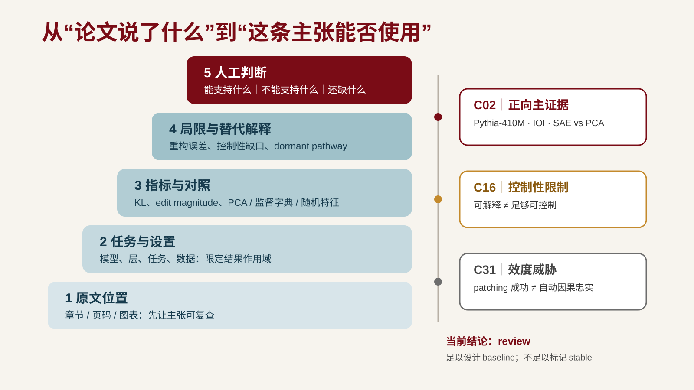

---
版本：v0.8.0
最后更新：2026-08-20
适用课次：第 4 课
文档类型：正式课堂 PPT 逐页内容母稿
状态：现行内容母稿；18 页封面与收束修订版 PPTX 已重建并通过三重检查
变更记录：
- v0.8.0 (2026-08-20): 封面精简为“第4讲 + 正式课名”并抬至模板两横线之间；新增 P17 独立知识点总结，原退出卡与第 5 课预告顺延为 P18；85-90 分钟收束段各分配 2.5 分钟
- v0.7.0 (2026-08-20): P12-P13 加入 MI-C02/C16/C31 证据阶梯与三卡判断；Keshav P11 保留为快速校准，页数与时间结构不变
- v0.6.0 (2026-08-09): 同步 L3/L4 分工；P02 明确 L3 已完成身份与一条拟用主张入口核验，L4 深化多主张与证据结构；统一阅读卡落点为 `reading-cards.md`
- v0.5.0 (2026-08-07): 统一完整阅读卡全字段验收与四态规则；P11-P13 演示改为 Keshav 2007 真实原文对象 + 显式标注的课堂构造 AI 输出 + 完整阅读卡；P15 模板补齐来源状态、AI 建议与不适用理由
- v0.4.0 (2026-08-07): 完成 17 页正式 PPTX；保留交大模板 master/layout、标题带、校徽与页码；17/17 页 notes 含 `[Sources]`；通过画布边界、模板保真、LibreOffice 重开、全页与高风险页视觉检查；P11-P13 画面与 notes 均标注虚构教学样例
- v0.3.1 (2026-08-07): 同步备课规划 v2.2.0；删除 P09 重复的“张冠李戴”；P11-P13 明确贯穿案例为虚构教学样例，不对应真实论文或实证结果
- v0.3.0 (2026-08-07): 同步 handout v0.2.0 与 teaching-plan v0.3.0——课堂最低产出统一为至少 1 张完整阅读卡；偏差审计允许记录 AI 错误/遗漏或已检查风险与依据；明确第 6 课前累计 3 张完整精读卡；17 页、8 段时间与逐页映射不变
- v0.2.0 (2026-08-06): gate 3-4 re-fit + gate 2 保守审校——方法段合并 3 处去重（P06 吸收 P11 检查五项、P08 吸收 P12 错读类型、P09 吸收 P10 主张区分），全文 20→17 页；每页建议时间按 备课规划 v2.1.0 第 4 课逐时间表 8 段重排（0:00-90:00 段内均分，修复演示段原 6 分钟→16 分钟缺口）；90 分钟节奏表页码列、逐页映射表与正文页码引用同步重编号；gate 2 去除 3 处备注 meta 自白（P05/P07/P08），标题腔保留 P01/P04 两处张力
- v0.1.0 (2026-08-06): 从零起草；20 页；含 §一 使用说明/本课目标/适用条件/90 分钟节奏表/逐页映射表 + 逐页 P01-P20 六段结构；节奏对齐 备课规划 v2.1.0 默认节奏与第 4 课目标
---

# 第 4 课逐页脚本｜AI 辅助精读与主张核验

## 一、使用说明

### 本课唯一主目标

> 学生为一条 verified 论文完成一次"AI 导航→原文核验→AI 质疑→偏差审计→人工定稿"的完整精读，产出带原文位置的阅读卡。

本课不追求在 90 分钟内读完整篇论文；目标是围绕至少 1 条关键主张完成全字段阅读卡。不适用的指标、对照或样本必须写明理由，不得留空。

### 适用条件

- 21-40 人；
- 连续 90 分钟；
- 中文授课，英文仅保留论文名、工具名和必要术语；
- 内容、节奏、映射、PPT 制作与三重检查已按 MI 修订轮重走。视觉规则见 [ppt-quality-gates.md](../../course/ppt-quality-gates.md) 与 [ppt-design-criteria.md](../ppt-design-criteria.md)，关键页规格见 [keystone-design-spec.md](./keystone-design-spec.md)；
- OpenCode、模型后端和论文原文访问尽量在课前确认；
- 学生优先使用候选文献表里的 verified 论文；没有者沿用第 1-3 课贯穿案例；
- 本课无正式提交。

### 90 分钟节奏

| 时间 | 页码 | 环节 | 课堂结果 |
| --- | --- | --- | --- |
| 0-5 分钟 | P01-P02 | 回扣第 3 课：入口核验之后，整篇论文仍需精读 | 精读方法入口 |
| 5-10 分钟 | P03-P04 | 本课目标与"读懂摘要但误解贡献" | 目标共识 |
| 10-27 分钟 | P05-P10 | 方法：五步流程 + 主张核验五项 + 阅读卡字段 | 精读与核验框架 |
| 27-43 分钟 | P11-P13 | 教师演示：AI 导航 + 原文核验 + 偏差审计 + 阅读卡 | 可复盘 trace |
| 43-48 分钟 | P14 | 实践说明：任务、模板与备用路径 | 选择论文进入实践 |
| 48-75 分钟 | P15 | 个人实践：五步流程、阅读卡第一版、偏差审计表 | 阅读卡初稿 |
| 75-85 分钟 | P16 | 两人互查：主张有位置、AI 与原文分栏、偏差审计有记录 | 反馈记录 |
| 85-87.5 分钟 | P17 | 本讲知识点总结 | 主链与边界回收 |
| 87.5-90 分钟 | P18 | 退出卡与第 5 课预告 | 卡点与需求 |

> 节奏对齐 `备课规划.md` v2.2.0 第 4 课逐时间表（8 段）。每页建议时间按段内页数均分，覆盖 0:00-90:00。

### 后续制作所需素材

- 一篇公开或已授权的演示论文；若沿用“结构化阅读卡与 AI 摘要遗漏率”贯穿案例，则使用明确标注的虚构教学片段，不伪装成真实论文证据；
- 一份 AI 摘要样例，故意混入 1 处过度概括、1 处位置错指、1 处限定遗漏；
- 阅读卡模板与偏差审计表模板（可投屏）；
- 核验样例：至少 1 条 verified、1 条 verified-with-caveat、1 条 rejected；
- 教师演示成功路径的截图或短录屏，供现场网络或模型失败时切换。

### 逐页映射

> 逐页映射门：每页标明内容母稿位置（handout 小节）。页面任务见各页"屏显内容"，证据角色见"来源与事实边界"，学生动作见"互动／操作"。本表已按 handout v0.2.0 复核。

| 页 | 内容母稿位置（handout） |
| --- | --- |
| P01 | §一 AI 辅助精读位置；§导读 |
| P02 | §导读；§一 |
| P03 | §学习目标 |
| P04 | §五 常见错误（读懂摘要但误解贡献） |
| P05 | §二·1 AI 导航 |
| P06 | §二·2 原文核验；§三·2 回到原文检查什么 |
| P07 | §二·3 AI 质疑 |
| P08 | §二·4 偏差审计；§三·3 错读、过度概括与伪造引用 |
| P09 | §二·5 人工定稿；§三·1 为什么区分 AI 主张与原文主张 |
| P10 | §四 阅读卡字段 |
| P11 | §六 贯穿案例 第一至二步 |
| P12 | §六 平行演示；MI 证据阶梯 |
| P13 | §六 平行演示；mi-reading-card-demo.md |
| P14 | §七 练习 1-5；§四 |
| P15 | §四 阅读卡模板；§二·4 偏差审计表 |
| P16 | §七 练习 3；同伴互查三问 |
| P17 | §二 五步流程；§三 主张核验与偏差审计；§学习目标 |
| P18 | §学习目标；第 5 课预告 |

---

## P01｜第4讲 AI 辅助论文精读与深度分析

### 屏显内容

第4讲 AI 辅助论文精读与深度分析

### 视觉结构

极简封面。只保留“第4讲 + 正式课名”，标题水平居中置于模板中部两条横线之间；不显示英文副标题、判断句或阶段说明。

### 教师讲述备注

开场放下论文清单。本课要处理的是：当 AI 已经能生成结构完整的论文摘要时，研究者怎样把精读变成可复查的"原文位置—主张—人工判断"追踪关系。

### 互动／操作

不展开课程行政信息，直接进入下一页回扣。

### 建议时间

0:00-2:30。

### 来源与事实边界

课程定位以 [syllabus.md](../../course/syllabus.md) 与 [备课规划.md](../备课规划.md) 第 4 课段为准。

---

## P02｜第 3 课之后，入口核验还不是完整精读

### 屏显内容

第 3 课建立了：
- 候选文献表
- 角色／状态／筛选决定
- 书目身份 + 一条拟用主张入口核验

仍未解决：
- 原文研究的任务和设置是什么？
- AI 复述的措辞与原文一致吗？
- AI 指向的图表位置真的对应它说的内容吗？

> 入口核验让一条拟用主张安全进入候选表，不代表整篇论文已完成精读。

### 视觉结构

左侧三项已建立工件，右侧是待精读的多条主张、位置与证据结构。中间向下箭头指向“本课：AI 辅助精读”。

### 教师讲述备注

回扣第 3 课：候选文献表里的 `verified` 表示身份和至少一条拟用主张与原文一致，不表示多条主张、证据结构和局限已经读清。本课把论文进一步拆成可追溯的主张—位置—证据—判断。

### 互动／操作

快问：你最近一次把 AI 摘要直接搬进阅读卡，是什么时候？只听回答，不评价。

### 建议时间

2:30-5:00。

### 来源与事实边界

回扣第 3 课 handout §四 来源审计；[AGENTS.md](../../AGENTS.md) 证据标准。

---

## P03｜本课目标与课堂产出

### 屏显内容

完成本课后，你能：

1. 用五步流程完成一篇论文的结构化精读；
2. 区分 AI 主张与原文主张，回到原文检查任务/设置/指标/对照/限定；
3. 识别 AI 错读、过度概括和伪造引用；记录 AI 错误/遗漏，未发现时记录已检查风险与依据；
4. 建立阅读卡，记录页码、图表或章节位置。

课堂最低产出：至少 1 张完整阅读卡 + 一条偏差审计记录 + 一条 AI 使用记录

> 本课不正式提交；第 6 课问题门前累计至少 3 张完整精读卡。

### 视觉结构

左侧四项目标列表，右侧最低产出与累计要求。底部一条"不正式提交"提示。

### 教师讲述备注

明确边界：本课目标是跑通一次完整精读流程，不是读完一整篇论文。课堂至少完成 1 张字段齐全的阅读卡；项目在第 6 课问题门前累计至少 3 张。

### 互动／操作

无。

### 建议时间

5:00-7:30。

### 来源与事实边界

[备课规划.md](../备课规划.md) 第 4 课目标段；[assignments.md](../../course/assignments.md) 研究门条件。

---

## P04｜读懂摘要不等于理解贡献

### 屏显内容

常见失败：
- AI 摘要直接进阅读卡
- 主张无原文位置
- "降低"被写成"消除"
- AI 质疑当结论
- 偏差审计缺位

> 流畅 ≠ 一致；结构完整 ≠ 贡献清晰。

### 视觉结构

左侧"AI 摘要当阅读卡"打叉，右侧"五步流程 + 带位置主张"打勾。底部一句判断。

### 教师讲述备注

暴露常见错误。AI 摘要可以快速建立阅读地图，但它的复述可能混入模型推断、措辞被改写、位置错指、限定遗漏。下面几页来看怎样用五步流程把精读变成可复查的追踪关系。

### 互动／操作

请学生举手：你是否曾经把 AI 摘要直接复制进阅读卡或证据表？只统计，不点名。

### 建议时间

7:30-10:00。

### 来源与事实边界

[AGENTS.md](../../AGENTS.md) 证据标准；[reading-list.md](../../course/reading-list.md) AI 辅助阅读协议。

---

## P05｜第一步：AI 导航

### 屏显内容

让 AI 给出：
- 中心问题（一句话）
- 论证结构（问题→方法→设置→结果→局限）
- 关键术语
- 预期证据位置（图表、公式、实验编号）
- 待追问问题

> 全部标记"未核验"。

### 视觉结构

五项纵向清单，右侧"未核验"水印标签。

### 教师讲述备注

AI 导航帮你快速建立阅读地图，决定哪些段落值得重点读。AI 指向的"图 3"可能是错的——这正是下一步要核验的。AI 导航输出只是路线提示，不是结论。

### 互动／操作

请学生说出：AI 导航的哪一项最容易被当成结论直接采纳？

### 建议时间

10:00-12:50。

### 来源与事实边界

讲义 §二·1 AI 导航；[reading-list.md](../../course/reading-list.md) 第二节 AI 辅助阅读协议。

---

## P06｜第二步：原文核验与检查五项

### 屏显内容

人工阅读指定段落，至少记录两个可复查位置：
- 章节、页码、图表、公式或实验编号

| 维度 | 检查问题 |
| --- | --- |
| 任务 | 原文任务和当前项目一样吗？ |
| 设置 | 输入、规模、条件是什么？ |
| 指标 | 用什么度量？定义一致吗？ |
| 对照 | baseline 是什么？公平吗？ |
| 限定 | 原文限定的范围是什么？ |

> 没有原文位置的主张，不能进入阅读卡的"作者主张"栏。

### 视觉结构

上方"两个可复查位置"要求，下方五项检查表格。

### 教师讲述备注

原文核验不可跳过。核验产物是带位置的主张，例如"作者主张 X → §3.2, p.5, Fig.2"。AI 说"见图 3"但图 3 不是该内容时，要重新定位。这五项对应 Keshav 三遍阅读法第二遍的深度阅读检查点——不是要求读完整篇，而是采纳一条主张前检查它能不能用于当前项目。任务不同、指标定义不同、对照不公平或限定不匹配，都意味着这条主张不能直接迁移。

### 互动／操作

让学生用自己的论文记录一个可复查位置，并选一条主张检查五项中最容易被忽略的。

### 建议时间

12:50-15:40。

### 来源与事实边界

讲义 §二·2 原文核验；§三·2 回到原文检查什么；Keshav "How to Read a Paper"（[reading-list.md](../../course/reading-list.md) 第 4 课）。

---

## P07｜第三步：AI 质疑

### 屏显内容

让 AI 根据已核验内容提出：
- 这个结果在什么条件下会被推翻？
- 对照是否公平？baseline 是否被低估？
- 样本规模是否足以支撑结论强度？
- 原文限定条件是否被笔记遗漏？
- 是否存在原文未讨论的替代解释？

> AI 质疑是候选问题，不是判断。需要回到原文检查。

### 视觉结构

五项问题清单，右侧"候选问题"标签。

### 教师讲述备注

AI 质疑暴露你自己的盲点。你可能因为觉得方法"看起来合理"而跳过对照设计或限定条件。AI 质疑的输出仍然只是候选问题，不是判断——你需要回到原文检查每个问题，而不是直接采纳。

### 互动／操作

请学生说出一个自己最容易跳过的检查项。

### 建议时间

15:40-18:30。

### 来源与事实边界

讲义 §二·3 AI 质疑；[reading-list.md](../../course/reading-list.md) 第二节。

---

## P08｜第四步：偏差审计与错读类型

### 屏显内容

偏差类型：
- 过度概括：原文"降低"被写成"消除"
- 位置错指：AI 说"见图 2"但图 2 不是该内容
- 限定遗漏：原文"计算机领域"被省略
- 张冠李戴：把参考文献的方法写成本文方法
- 伪造引用：题名/作者/页码与正式来源不符

最小记录表：
| AI 输出 | 偏差类型 | 原文实际 | 核验位置 | 处理 |

> 至少记录一处 AI 错误或遗漏；未发现时记录已检查风险与核验依据。第 3 课处理"文献是否真实"，本课处理"复述是否一致"。

### 视觉结构

上方五类偏差，下方最小记录表模板。

### 教师讲述备注

偏差审计记录的是可复查的偏差，是后续评价 AI 辅助阅读工作流的重要证据。第 3 课的来源审计是入口核验，本课是内容核验——一条论文可以 verified（存在且 DOI 正确），但 AI 对它的复述仍可能错读、过度概括或位置错指。偏差审计表记录的就是这种内容层面的偏差。未发现明显错误时，记录检查过的风险点及核验依据，不虚构错误。

### 互动／操作

无。直接进入下一步。

### 建议时间

18:30-21:20。

### 来源与事实边界

讲义 §二·4 偏差审计；§三·3 错读、过度概括与伪造引用；第 3 课 handout §四 来源审计；[AGENTS.md](../../AGENTS.md) "失败记录是后续评价工作流的重要证据"。

---

## P09｜第五步：人工定稿与主张区分

### 屏显内容

一条 AI 复述的可能来源：
- 原文确实写了（作者主张）
- 原文相关，AI 推断出更具体结论（模型推断）
- 原文没写，AI 根据常识补充（模型新增）
- 措辞强度被改写（过度概括）

> 只有第一种能进入"作者主张"栏。

由学生写出最终阅读卡，区分：
- 作者主张（带原文位置）
- 原文证据（指标/对照/样本/限定）
- 个人判断（适用性/待验证/与项目关系）
- AI 建议（导航/质疑/偏差记录）

> 判断责任在学生。AI 可以建议，不能定稿。

### 视觉结构

上方五项来源清单（第一项打勾，后四项打叉并标"待核验/偏差"），下方四栏分栏卡片，"作者主张"栏高亮。

### 教师讲述备注

不区分的话，研究者会把 AI 推断误当成作者主张，再带进证据地图。第 5 课的证据地图质量取决于阅读卡的主张是否真实来自原文。人工定稿的判断责任在学生——阅读卡里"作者主张"必须能回到原文位置，"个人判断"必须写明理由和适用边界。AI 可以建议措辞、补充候选、提出质疑，但四栏必须分清，不能混在一栏。

### 互动／操作

请学生指出：你之前的阅读卡或笔记里，哪一栏和 AI 建议混在一起了？

### 建议时间

21:20-24:10。

### 来源与事实边界

讲义 §二·5 人工定稿；§三·1 为什么区分 AI 主张与原文主张；[AGENTS.md](../../AGENTS.md) "AI 输出本身不构成证据"；[reading-list.md](../../course/reading-list.md) 第二节第五步。

---

## P10｜阅读卡字段

### 屏显内容

阅读卡最小字段：
- 论文 / 证据角色（承接第 3 课）
- 来源核验状态
- 中心问题（一句话，核验后）
- 作者主张（每条标注原文位置）
- 原文证据（指标/对照/样本/限定）
- 局限与边界（作者自述 + 个人判断）
- 个人判断（适用性/待验证/与项目关系）
- AI 建议（待核验）
- AI 偏差审计（错误/遗漏，或已检查风险与依据）
- 核验状态

> 没有原文位置的主张，不能进入"作者主张"栏。

### 视觉结构

阅读卡模板占主体，下方一行“写入项目 reading-cards.md”。

### 教师讲述备注

阅读卡是本课产出，也是第 5 课证据地图的输入。每条作者主张必须标注原文位置；所有字段有值或写明不适用理由才算完整。`pending` 只留线索区；`verified-with-caveat` 保留限定且不单独支撑 `stable`；`rejected` 仅留审计。

### 互动／操作

无。进入演示。

### 建议时间

24:10-27:00。

### 来源与事实边界

讲义 §四 阅读卡字段；[starter-template.md](../../course/starter-template.md) 工件追踪。

---

## P11｜演示：真实原文 vs 待核验 AI 输出

### 屏显内容

真实论文：Keshav, *How to Read a Paper*, DOI `10.1145/1273445.1273458`

原文定位：p.83 摘要与 §2/§2.1；p.84 §4

课堂构造 AI 输出｜未核验｜非真实模型记录：
- “对照实验证明阅读时间降低 50%”
- “第一遍固定需要 5 分钟”

原文核验：三遍阅读法｜第一遍约 5–10 分钟｜未报告该对照实验

### 视觉结构

真实 PDF 第 1 页为主视觉工件，右侧仅展示两条待核验 AI 输出与三项原文核验。

### 教师讲述备注

论文页是真实来源，AI 输出两句是课堂构造，二者不得混为同一证据对象。先让学生在原文中定位，再给判断。

### 互动／操作

运行前请学生预测：AI 导航的哪一项最可能出错？运行后让学生指出差异点。

### 建议时间

27:00-32:20。

### 来源与事实边界

- Keshav, S. "How to Read a Paper." DOI: https://doi.org/10.1145/1273445.1273458
- 公开 PDF：https://cs.uwaterloo.ca/~Brecht/courses/856/readings/how-to-read/keshav-paper-reading.pdf
- AI 输出为课堂构造，非真实模型记录

---

## P12｜MI 演示：三篇论文如何分工

### 屏显内容

公开论文主张｜不含博士生未发表内容



- C02：同设置正向主证据｜Pythia-410M · IOI · SAE vs PCA
- C16：控制性限制｜可解释 ≠ 足够可控制
- C31：效度威胁｜patching 成功 ≠ 自动因果忠实

> 三条都可进入证据地图，但 caveat 必须一起移动。

### 视觉结构

证据阶梯 SVG 为主视觉；右侧只保留三篇论文角色与一句当前状态。

### 教师讲述备注

从 P11 的方法校准切换到真实研究争议。让学生看到“主证据、限制证据、效度威胁”不是按赞成/反对分组，而是共同约束一条可用主张。

### 互动／操作

让学生判断：C31 应标“反驳 C02”，还是“限制 C02 可推出的结论”？

### 建议时间

32:20-37:40。

### 来源与事实边界

[mi-reading-card-demo.md](./mi-reading-card-demo.md)；MI-C02/C16/C31 claim-level 位置与 caveat 见 [MI trace](../lesson-03/mi-search-trace-demo.md) §5；图源见 [assets/README.md](./assets/README.md)。

---

## P13｜MI 演示：从 patching 成功到受限判断

### 屏显内容

初版 AI 归纳｜待核验：
> C02 Fig.3 证明 SAE 特征对 IOI 具有因果忠实性。

原文与对照材料给出的受限判断：
- C02 pp.5-6：该设置下 SAE 用更少 patch / 更小 edit 达到目标 KL
- C02 p.9：重构误差与跨任务泛化仍是限制
- C16：可解释特征的控制能力可能弱于监督字典
- C31：子空间 patching 可能激活 dormant pathway

人工定稿：
> 足以启动 SAE-vs-PCA baseline；不足以标记因果忠实为 stable。

状态：verified-with-caveat → 综合判断 review

### 视觉结构

左侧显示待核验归纳，右侧为四条原文约束，底部红色结论条显示“baseline 可启动 / stable 不成立”。

### 教师讲述备注

演示同一条主张如何被三篇论文共同收窄。明确 C16/C31 的设置不同，因此承担方法论限制，不冒充同设置反驳。

### 互动／操作

请学生给出 L9 还需补的一项证据：重构敏感性、随机/监督方向、held-out 或正常路径证据。

### 建议时间

37:40-43:00。

### 来源与事实边界

[mi-reading-card-demo.md](./mi-reading-card-demo.md)；MI-C02/C16/C31；[mi-case-registry.md](../../references/notes/mi-case-registry.md) MI-04-01–03。

---

## P14｜个人实践：跑通一次五步精读

### 屏显内容

本轮完成：
1. 选一篇可访问原文的 verified / verified-with-caveat 论文（没有者使用 Keshav 演示包）
2. AI 导航：中心问题/结构/术语/预期位置/待追问
3. 原文核验：至少两个可复查位置
4. AI 质疑：根据已核验内容提反例
5. 偏差审计：AI 错误/遗漏，或已检查风险与依据
6. 完整阅读卡：全字段有值；不适用项写理由
7. 写一条 AI 使用记录

选择顺序：自有已核验论文 → Keshav 真实演示包

### 视觉结构

左侧七步清单，右侧选择顺序。

### 教师讲述备注

没有可访问原文的学生使用 Keshav 演示包，但要自己重新完成一条主张的定位、边界判断和偏差审计，不直接复制示例卡。

验收标准：
- 至少 1 张完整阅读卡，字段齐全；
- 每条作者主张标注原文位置；
- 偏差审计记录 AI 错误/遗漏，或已检查风险与依据；
- 原文证据写明指标/对照/样本/限定；
- AI 使用记录完整。

### 互动／操作

43:00-48:00 说明任务；48:00 后切换至 P15 模板停留页。教师巡视只处理共同卡点，不逐台排障。模型不可用者使用纸面或 Markdown 模板完成。

### 建议时间

43:00-48:00，其中任务说明 5 分钟。

### 来源与事实边界

[starter-template.md](../../course/starter-template.md) 最小文件结构；第 3 课候选文献表。

---

## P15｜实践停留页：模板

### 屏显内容

阅读卡模板：

```text
论文：题名 / 作者 / 年份 / DOI
来源状态：
证据角色：主证据 / 补充 / 对比 / 探索线索
中心问题（一句话，核验后）：
作者主张（带位置）：
  - 主张 1 → §x.x, p.x, Fig.x
原文证据：
  指标：　对照：　样本：　限定：
局限与边界：
  作者自述：　个人判断：
个人判断：
AI 建议（待核验）：
AI 偏差审计（错误/遗漏，或已检查风险与依据）：
内容状态：
```

偏差审计表模板：

```text
| AI 输出 | 偏差类型 | 原文实际 | 核验位置 | 处理 |
```

写入位置：reading-cards.md

完整 = 每个字段有值，或写明“不适用 + 理由”

### 视觉结构

两块代码模板上下排列，底部写入位置。

### 教师讲述备注

模板投屏停留。课堂至少完成 1 张围绕 1 条关键主张的全字段阅读卡；本课不正式提交，第 6 课问题门前累计至少 3 张。断网/无模型时使用 `reading-card-demo.md` 的真实原文 trace，并在日志中写明未执行实时模型。

### 互动／操作

无。本页停留至 75:00。

### 建议时间

停留页，覆盖 48:00-75:00。

### 来源与事实边界

讲义 §四 阅读卡字段；§二·4 偏差审计表。

---

## P16｜同伴互查三问

### 屏显内容

两人互查三问：
1. 主张有位置吗？每条作者主张标注了章节/页码/图表吗？
2. AI 与原文分栏了吗？作者主张和个人判断没有混在一起吗？
3. 偏差审计可复查吗？有 AI 错误/遗漏，或已检查风险与核验依据吗？

作者记录：采纳／暂不采纳／待核验

> 同伴只提问题，不替作者决定。

### 视觉结构

左侧三问，右侧三种反馈处理状态。

### 教师讲述备注

每人约 3-5 分钟：一人用 45 秒说明论文、一条带位置主张，以及一处 AI 错误/遗漏或已检查风险；同伴按三问反馈；作者记录处理决定。反馈不要求立即改写。反馈者不替代作者修改，不形成共同提交。人数为奇数时组成三人组，每人缩短说明时间。

### 互动／操作

75:00-85:00 两人互查。

### 建议时间

75:00-85:00。

### 来源与事实边界

同伴反馈为形成性活动，不单独计分，不共同提交（[assignments.md](../../course/assignments.md)）。

---

## P17｜本讲知识点总结

### 屏显内容

AI 导航 → 原文核验 → 偏差审计 → 人工定稿

1. **AI 导航**：先定位任务、设置与关键位置。
2. **原文核验**：逐条检查指标、对照与限定。
3. **偏差审计**：记录错读、遗漏，或已检查风险及依据。
4. **人工定稿**：保留原文位置与判断边界。

> 关键边界：AI 输出只提供阅读线索；关键主张必须绑定原文位置，并由研究者作最终判断。

### 视觉结构

四步横向流程；每步由编号、动作和一句核验要求组成。底部用红色浅底框突出关键边界。

### 教师讲述备注

用四步主链回收本讲，不逐页复述。强调阅读卡的价值不在“摘要更完整”，而在原文位置、作者主张、AI 偏差和人工判断能够相互追踪。本页不引入新任务。

### 互动／操作

学生用一句话指出自己阅读卡目前停在哪一步。

### 建议时间

85:00-87:30。

### 来源与事实边界

讲义 §二 五步流程、§三 主张核验与偏差审计；[AGENTS.md](../../AGENTS.md) 证据标准。

---

## P18｜退出卡与第 5 课预告

### 屏显内容

退出卡：
- 今天最清楚的一点；
- 仍然困惑的一点；
- 阅读卡当前字段是否齐全；
- 偏差审计记录了什么错误/遗漏或已检查风险；
- 第 5 课需要补的证据地图或空白案例。

第 5 课预告：综述结构、证据地图与研究空白

> 不新增课后正式作业；第 6 课问题门前累计至少 3 张完整精读卡。

### 视觉结构

左侧退出卡五项，右侧第 5 课预告。

### 教师讲述备注

回扣本课目标：学生不需要在 90 分钟内读完整篇论文。课堂至少完成 1 张完整阅读卡、一条偏差审计记录和一条 AI 使用记录，就形成可继续检查的起点。

课后引导阅读（采用 AI 导航→原文核验→AI 质疑→偏差审计→人工定稿流程）：
- Keshav "How to Read a Paper"，约 20 分钟，核心阅读；
- Booth et al. *The Craft of Research*, 5th ed., Chapter 4，任选，约 25 分钟；
- 沈向洋、华刚中文检查表，任选，约 15 分钟。

项目推进：继续完善课堂阅读卡，并在第 6 课问题门前累计至少 3 张与个人项目直接相关的完整精读卡；若课堂已完成 1 张，通常还需补 2 张，每张约 30-45 分钟。持续写入 `reading-cards.md`，第 5 课再重组进证据地图，不逐周正式提交。

### 互动／操作

学生提交退出卡或保存在个人项目。教师收集共性问题，用于第 5 课前调整。

### 建议时间

87:30-90:00。

### 来源与事实边界

- Keshav, S. *ACM SIGCOMM CCR* 37(3), 83–84 (2007). DOI: [10.1145/1273445.1273458](https://doi.org/10.1145/1273445.1273458)。
- Booth et al. *The Craft of Research*, 5th ed. [出版社页面](https://press.uchicago.edu/ucp/books/book/chicago/C/bo215874008)。
- 阅读规则见 [reading-list.md](../../course/reading-list.md)。
