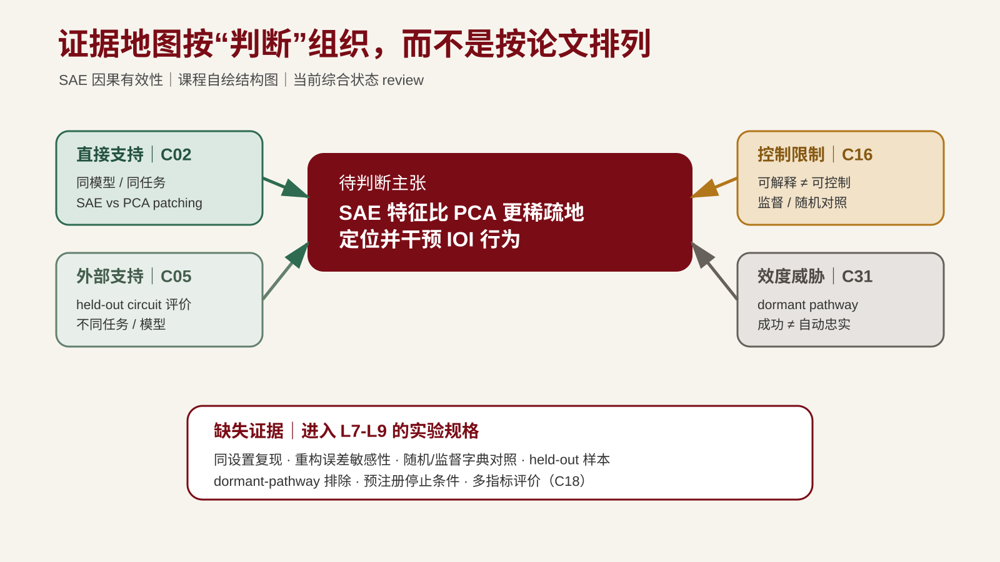

---
版本：v1.0.0
最后更新：2026-08-20
适用课次：第 5 课教师演示；第 6-9 课作为接口
文档类型：公开材料证据地图示例
---

# MI 证据地图示例：SAE patching 与因果忠实

> 案例边界：本图只组织公开论文主张，不包含博士生未发表研究。论文来自不同模型、任务和协议，表中的角色不能当作效应量合并。

## 待判断主张

在 Pythia-410M 的 IOI 任务上，SAE 特征能否比 PCA 方向更稀疏地定位并干预模型行为；这种 patching 成功还需要哪些证据，才能支持“因果忠实”的解释？

*图注：课程自绘结构图。绿色为支持，黄色/灰色为限制与效度威胁，下方是当前缺失证据。来源与许可见 [assets/README.md](./assets/README.md)。*

## 相关工作矩阵

| 证据项 | 任务/模型 | 比较或评价 | 已核主张 | 对本问题的角色 | 不允许的外推 |
| --- | --- | --- | --- | --- | --- |
| MI-C02 | IOI / Pythia-410M layer 11 | SAE vs PCA；KL 与 edit magnitude | SAE 用更少 patch、更小 edit 达到相近目标 KL | 直接主证据 | 不能由 patching efficiency 直接推出因果忠实 |
| MI-C16 | IOI / GPT-2 Small | 监督字典、普通 SAE、冻结随机 decoder SAE | SAE 可解释但控制弱于监督字典；存在 occlusion/over-splitting | 对比/限制 | 不是 C02 同设置反驳 |
| MI-C31 | IOI 与事实编辑 / 多种子空间 | 理论构造、幻觉案例、成功案例 | patching 可通过 dormant pathway 改变输出 | 效度威胁 | 不能概括为所有 activation patching 无效 |
| MI-C18 | GPT-4 与公开模型 SAE | feature recovery、解释性、downstream effects | 重构和稀疏度不是最终目标，需要多指标评价 | 评价补充 | 不单独证明因果忠实 |
| MI-C05 | 主谓一致等 / Pythia-70M、Gemma-2-2B | held-out faithfulness/completeness、SHIFT | SAE feature circuits 可进入可评价干预管线 | 下游外部支持 | 不直接复现 Pythia-410M IOI 结果 |

## 四视图

| 视图 | 证据 | 当前判断 | 回写动作 |
| --- | --- | --- | --- |
| 直接证据 | C02 | 同设置正向结果足以提出最小复现 | L6 固定问题、命题与非例 |
| 补充证据 | C18、C05 | 多指标与下游 circuit 评价具有可行性 | L7 指标与 held-out 评价 |
| 冲突/限制 | C16、C31 | 可解释、可控制、patching success、causal faithfulness 需分开 | L7 加竞争假设；L9 加对照 |
| 空白 | 同设置的控制与效度证据不足 | 不能标记 `stable` | 进入实验规格与 baseline |

## 研究判断记录

| 编号 | 判断 | 依据 | 支持强度 | 适用边界 | 状态 | 影响工件 |
| --- | --- | --- | --- | --- | --- | --- |
| J-MI-01 | 以 C02 的 Pythia-410M IOI 设置作为最小 baseline 起点 | C02 pp.5-6 | 中 | 只限该模型、层、任务和指标 | review | L6 problem-definition；L9 experiment-spec |
| J-MI-02 | 把“稀疏干预有效”与“因果忠实”拆成两个判断 | C16、C31 | 中 | 论文设置不同，作为方法论约束 | review | L7 H1/H2；L9 对照 |
| J-MI-03 | 评价至少覆盖效率、重构敏感性、held-out 效果与替代路径 | C02、C18、C31 | 中 | 具体操作定义待 L7-L9 固定 | review | L7 指标；L9 停止条件 |

## 真实失败/死路记录

| 记录 ID | 失败对象 | 预期与实际 | 原因 | 处理 | 回写位置 |
| --- | --- | --- | --- | --- | --- |
| F-MI-01 | 把 C02 Fig.3 当作“因果忠实证明” | 预期直接形成结论；实际只证明该干预协议下更高效 | 混淆 intervention success 与 representation faithfulness | 收窄为可复现主张，引入 C31 效度威胁 | 证据地图冲突格、L6 可证伪命题、L9 对照 |

## 空白候选

缺角空白：已有同设置的 SAE-vs-PCA patching 效率比较，但缺同模型同任务下对重构误差、随机/监督字典、held-out 样本与 dormant pathway 的联合检验。该空白通过真实性初检，但重要性与课程周期可行性仍要在 L6 用非例、停止条件和计算预算收窄。

来源详情与 claim-level 状态见 [MI search trace](../lesson-03/mi-search-trace-demo.md) §5；许可与教学可用性见 [MI registry](../../references/notes/mi-case-registry.md)。
