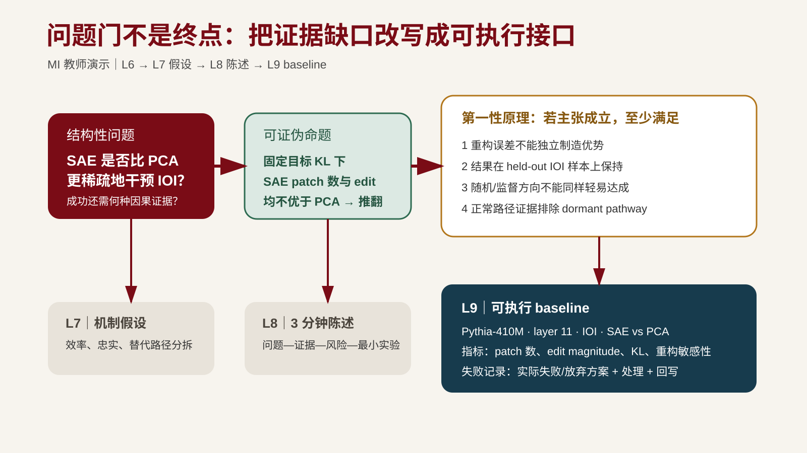

---
版本：v1.1.0
最后更新：2026-08-20
适用课次：第 6 课
文档类型：学生正式讲义
状态：现行；问题门九项条件、第 3-6 课累计路径、MI/虚构双线边界与工件落点已对齐
变更记录：
- v1.1.0 (2026-08-20): 同步问题门新增失败记录条件；增加 MI 公开问题定义、九项门自查与 L7-L9 baseline 接口图
- v1.0.0 (2026-08-10): G3 选题训练增强——§一新增"问题来源交叉检查与候选题池比较"小节（四维选题标准卡：意义/新颖性/可行性/兴趣；新颖性三类正评）；学习目标增四维比较与来源交叉检查（原目标 6 顺延为目标 7）；§五·4 问题定义文件增候选题池字段；§六 常见错误增"问题来源只有文献空白"；§七 贯穿案例第一步增候选题比较；§八 插入练习 2（候选题生成与四维比较：异常/痛点候选 + 比较筛选），原练习 2-6 顺延为练习 3-7；术语表与延伸阅读增补（霍强）；门条件不变；学习目标变更，升 major
- v0.4.0 (2026-08-07): 转为正式学生讲义；第一性原理分析作为 `problem-definition.md` 的课程扩展小节落档，不伪装成学生已完成的真实证据
- v0.3.0 (2026-08-07): 将贯穿案例统一标为虚构教学样例；不再声称虚构案例已完成真实窄检索，空白保留为待真实核验；同步问题门证据地图四视图与 AI 风险记录完整口径
- v0.2.0 (2026-08-07): 精确对齐 assignments.md Checkpoint 1 八项门条件；保留“AI 错误/过度概括/遗漏或已检查风险”的合法路径；新增第 3-6 课从课堂最低产出累计到≥10 篇候选文献、≥3 张完整精读卡的时间、位置和提交边界
- v0.1.0 (2026-08-06): 从零起草；定位阶段一“问题定义”+阶段二“第一性原理分析”；承接第 5 课证据地图与研究空白，收敛为可检验问题；含非例、可证伪命题、第一性原理推导、问题门提交清单（对齐 assignments.md 与 starter-template.md）；为第 7 课机制假设铺垫
---

# 第六讲｜问题定义、第一性原理与问题门

## 导读

第 3-5 课完成了检索、精读和证据地图，产出了研究空白候选与候选题池初稿。但研究空白本身还不是研究问题。"还没有论文写过 X"只能说明地图上有一个空格，不说明这个空格值得填充、能否在课程周期内做出最小验证、以及填充后能回答什么。同样，候选题池里的候选也还不是选定的研究问题——它们需要在重要性、新颖性、可行性和兴趣四个维度上比较筛选。

本课对应八阶段研究链路的阶段一"问题定义"和阶段二"第一性原理分析"，是"文献、证据与问题"模块的末课，也是全课第一次正式提交——问题门。它的核心转换是：

> 从"还没有人做过"转向"在什么条件下、什么机制是否导致什么结果，什么观察会推翻它"。

完成本课后，你将提交问题门材料包，包含一个范围清楚、有非例、有可证伪命题的研究问题，和一份从基本约束推导出待验证前提的第一性原理推导。第 7 课将在这些问题上建立机制假设和实验设计。

> **案例边界**：本讲“结构化阅读卡是否降低 AI 摘要限定条件遗漏率”的贯穿案例是课程虚构教学样例，用于演示问题重写、推导和门条件自查；它不对应真实论文、检索命中或实证结果。真实项目必须填写自己的检索记录与核验状态。

## 学习目标

完成本讲后，你应该能够：

1. 区分主题、研究问题和待验证主张，并把宽泛兴趣改写为范围清楚、可证伪、周期可完成的研究问题；
2. 用非例界定问题边界，说明什么不算本问题，防止项目随检索膨胀；
3. 写出至少一个可证伪命题，指明什么观察结果会使当前主张不成立；
4. 从基本约束、作用机制和不可违背条件推导待验证前提，并说明第一性原理分析的适用边界；
5. 用"So what?"和"Who cares?"检查问题重要性，交叉检查问题来源，区分问题新、视角新和方法新；
6. 用意义、新颖性、可行性和兴趣四维标准比较候选题池，说明选题理由；
7. 对照问题门条件完成提交前自查。

---

## 一、从研究空白到结构性问题

### 1. 主题、问题与主张

第 1 课已经区分过报告与研究的差别，这里从问题形成角度再压缩一次：

| 层次 | 典型表述 | 缺什么 |
| --- | --- | --- |
| 主题 | AI 辅助论文阅读 | 范围、条件、可比较对象 |
| 研究问题 | 在需要逐条核验引用的 CS 论文阅读任务中，结构化阅读卡是否降低 AI 摘要的限定条件遗漏率？ | 候选答案、可证伪性、可行性 |
| 待验证主张 | 如果阅读卡强制定位原文且评价者使用同一 rubric，则遗漏率可被测量且差异可归因于阅读卡结构。 | 实验证据、竞争假设排除 |

> 来源参考：Booth, W. C. et al. *The Craft of Research*, 5th ed. University of Chicago Press, 2024. Chapter 1, "From Topics to Questions"。用途：把兴趣收敛为研究问题，并用 "So what?"、实际后果和知识后果检查重要性（见 [reading-list.md](../../course/reading-list.md) 第 6 课）。

研究问题不是把主题缩小一点，而是把主题变成"什么条件下、什么对象、什么干预、什么结果、什么比较"的结构。缺少其中任何一项，综述和实验都无法定位。

### 2. 从研究空白到问题的转换

第 5 课识别了三类研究空白（冲突空白、缺角空白、新问题空白），并对每个候选执行了真实性、重要性和可行性三步检验。通过三步检验的空白候选进入本课，需要进一步改写为结构性问题。

转换的关键动作：

1. **从"没人做过"到"在 X 条件下，Y 机制是否导致 Z"**：把空格的描述改写为一个包含条件、机制和可观察结果的问题。
2. **明确包含范围**：问题适用于什么任务、什么材料、什么对象。
3. **写出非例**：明确什么不算本问题，防止边界漂移。
4. **写出可证伪命题**：指明什么观察结果会使主张不成立。

以虚构教学样例为例。第 5 课的缺角空白候选 G1 是：在样例相关工作矩阵中，"阅读卡是否强制定位原文"这一子问题整列空白，当前标为“待真实窄检索”，不预设命中数或结论。

本课把它改写为：

> **研究问题**：在需要逐条核验引用的计算机论文阅读任务中，结构化阅读卡是否降低 AI 摘要的限定条件遗漏率？
>
> **包含范围**：带引用的计算机领域论文阅读任务；AI 生成摘要；限定条件遗漏率作为指标。
>
> **非例**：不比较不同大模型的通用写作质量，不评价综述是否具有语言美感，不处理需要专业实验设备的学科。
>
> **可证伪命题**：如果加入结构化阅读卡后，限定条件遗漏率没有下降，或者人工核验成本显著增加且无法接受，则"阅读卡改善该科研动作"的主张不成立。

### 3. "So what?" 和 "Who cares?"

问题不止要清楚，还要重要。Booth 等人提出两个检查：

- **"So what?"（知识后果）**：如果这个问题不被回答，当前证据地图的哪条主张无法成立，或哪个机制假设无法被检验？如果回答了，研究者或实践者将能做什么之前做不到的事？
- **"Who cares?"（实际后果）**：谁会从答案中受益？是研究者、实践者还是决策者？受益的形式是什么？

> 来源参考：Booth et al. *The Craft of Research*, 5th ed., Chapter 2, "From Questions to a Problem"。用途：用实际后果和知识后果检查重要性，而非以"新颖"替代"重要"。

重要性来自问题在论证链上的位置，不是因为它"新"。第 5 课的三步检验已经做过一次重要性检查，这里从空白候选升级为问题后需要再确认一次：问题是否处于证据地图中某条关键论证链上？如果不回答它，哪些后续判断无法成立？

### 4. 问题来源交叉检查与候选题池比较

**问题来源交叉检查**。第 5 课 §四·1 给出了六条问题生成路径。收敛问题前先问：这个候选题从哪条路径来？如果它只来自文献空白，必须再回答一个问题：

> 如果文献里没有这个空白，这个问题还值得回答吗？

答得出，说明问题背后有更基本的观察、约束或实践需求，空白只是它的一个入口；答不出，说明它可能只是填格子，有两条出路：回到更基本的异常观察或约束重新推导问题，或者明示其重要性只在当前论证链内（这是合法的，但要写进重要性说明，不能冒充更广泛的意义）。

**四维选题标准卡**。候选题池里通常不止一个候选。用四个维度比较，而不是"哪个最先想到"：

| 维度 | 检查问题 | 依据 |
| --- | --- | --- |
| 意义 | 不回答它，哪条论证链无法成立？谁受益？ | Booth"知识后果/实际后果"、Hamming"重要问题" |
| 新颖性 | 它在哪一类上是新的：问题新、视角新还是方法新？ | 见下方三类新颖性 |
| 可行性 | 课程周期内能否做出最小验证？需要什么材料、数据或设备？ | 第 5 课可行性检验 |
| 兴趣 | 你是否愿意在课程周期之外继续投入？判据是什么？ | 个人判据，记录理由即可 |

**新颖性的三类正评**。"新"不是"没人做过"的同义词，要说明新在哪一类：

- **问题新**：提出一个此前没有被明确提出的问题；
- **视角新**：对已知问题给出新的框架、机制解释或重新表述；
- **方法新**：用新方法、新工具或新数据条件回答已有问题。

课程项目至少满足其中一类，并在 `problem-definition.md` 写明；同时警惕用"新"替代"重要"——四类检查里意义仍然优先。

> 来源参考：Hamming, R. W. "You and Your Research." *The Art of Doing Science and Engineering*. Stripe Press, 2020 reissue. 本课只读"重要问题"和研究品味部分。用途：区分"可做""新颖"和"值得投入"的问题。

> 来源参考：胡晓峰：《浅谈科研课题中的"科学问题"》。[本地副本](<../../references/library/research-method/how to think/胡晓峰：浅谈科研课题中的“科学问题”.pdf>)。用途：识别把背景、意义、工程任务或"怎么做"误写成科学问题的情况（见 [reading-list.md](../../course/reading-list.md) 第 6 课课堂案例）。

---

## 二、非例：问题边界的负定义

### 1. 什么是非例

非例说明"什么不算本问题"。它和"包含范围"一起构成问题的正负边界。非例的价值在于防止项目随检索不断膨胀：当你在搜索中看到一篇"似乎相关"的论文时，非例帮你判断它到底在不在问题范围内。

第 1 课已经给出了非例的基本概念，本课把它系统化：

- **明确不包含的范围**：任务、材料、对象或指标中哪些不在本问题内。
- **容易混淆但实际不属于本问题的例子**：指出那些看起来相关、实际不可比或不在范围内的方向。
- **与包含范围形成对照**：让读者能从正反两侧判断一篇论文是否在范围内。

### 2. 非例的写法

一个好的非例不只是"不做 X"，还要说明为什么不算：

- **不可比的例子**：使用了不同任务设置的研究，结论不能直接比较。
- **不同层面的例子**：评价通用写作质量 vs. 评价限定条件准确性，不在同一层面。
- **超出周期的例子**：需要专业实验设备或大规模数据采集的研究，超出课程周期。

以贯穿案例为例：

> 非例：
> - 不比较不同大模型的通用写作质量（不同层面）；
> - 不评价综述是否具有语言美感（不同指标）；
> - 不处理需要专业实验设备的学科（超出周期与范围）。

### 3. 非例的常见错误

| 错误类型 | 表现 | 后果 |
| --- | --- | --- |
| 非例过宽 | "不做与本课题无关的研究" | 没有实质约束，任何方向都可以被说成"相关" |
| 非例过窄 | "不使用数据集 X" | 等同于排除某个数据集，而非界定问题边界 |
| 非例与可证伪命题矛盾 | 非例排除了检验条件 | 可证伪命题无法成立 |
| 非例只是否定清单 | "不评价文风、不比较模型、不做实验" | 否定了范围但没说清为什么不算 |

胡晓峰在《浅谈科研课题中的"科学问题"》中指出一种常见错误：把背景、意义或"怎么做"误写成科学问题。非例的作用之一就是把这些"看起来是问题但实际不是"的表述挡在问题定义之外。

---

## 三、可证伪命题

### 1. 什么是可证伪命题

一个命题可证伪，意味着能指出什么观察结果会使它不成立。可证伪不是"已经被证伪"，而是"原则上可以被推翻"。

不可证伪的表述例子：

> 结构化阅读卡是有用的。

"有用"无法被推翻，因为没有指明什么指标、什么对照、什么阈值。改进为：

> 在需要逐条核验引用的计算机论文阅读任务中，使用结构化阅读卡的 AI 摘要相比自由摘要，限定条件遗漏率更低。

这个命题可以被推翻：如果遗漏率没有下降，或者人工核验成本显著增加且无法接受，主张即不成立。

### 2. 可证伪命题的写法

一个完整的可证伪命题至少包含：

- **条件**：在什么任务、什么材料、什么设置下；
- **干预**：什么方法或机制被引入；
- **结果**：什么指标被测量；
- **对照**：与什么基线比较；
- **推翻条件**：什么观察结果会使主张不成立。

检查清单：

1. 指明条件、对象、干预、结果了吗？
2. 有明确对照吗？
3. 能指出什么观察结果会推翻当前主张吗？
4. 是否避免了"是否有效"这类无法证伪的表述？

> 来源参考：Platt, J. R. "Strong Inference." *Science* 146(3642), 347-353 (1964). DOI: [10.1126/science.146.3642.347](https://pubmed.ncbi.nlm.nih.gov/17739513/)。用途：用竞争假设、关键实验和排除逻辑形成可证伪命题（见 [reading-list.md](../../course/reading-list.md) 第 6 课）。

### 3. 竞争假设与排除逻辑

Platt 的"强推断"方法要求：为每个问题生成多个竞争假设，设计能区分它们的实验，用实验结果排除部分假设。这不要求每个课程项目都实现完整强推断，但要求研究问题有竞争假设的意识：

- 当前主张的替代解释是什么？
- 什么实验能区分当前主张和替代解释？
- 如果结果与当前主张一致，是否也能与替代解释一致？

以贯穿案例为例：

- **假设 H1**：阅读卡强制定位原文，减少把模型推断误写成原文结论的情况，从而降低遗漏率。
- **替代假设 H2**：阅读卡只是让学生花了更多时间，遗漏率下降来自时间投入而非阅读卡结构。
- **区分实验**：设置时间控制组（自由摘要 + 等量额外时间），比较三组：自由摘要、阅读卡、自由摘要 + 等量时间。如果只有阅读卡组遗漏率下降，H2 被排除。

课程项目不要求实现全部三组对照，但要在问题定义阶段说明存在哪些替代假设，以及什么实验能区分它们。

---

## 四、第一性原理推导

### 1. 什么是第一性原理分析

第一性原理分析指识别问题的基本约束、作用机制和不可违背条件，并由此推导待验证前提。它不是脱离文献、数据和既有工作的通用捷径；推导结果必须继续接受外部证据检验。

> 课程定位见 [备课规划.md](../备课规划.md) 执行原则 9："第一性原理分析"只指识别问题的基本约束、作用机制和不可违背条件，并由此推导待验证前提；它不是脱离文献、数据和既有工作的通用捷径，推导结果必须继续接受外部证据检验。

> 证据标准见 [AGENTS.md](../../AGENTS.md)：AI 输出本身不构成证据。第一性原理推导的结论同样需要回到文献、数据或实验中检验。

### 2. 推导步骤

第一性原理推导分四步：

**步骤一：识别基本约束**

基本约束是问题成立所依赖的必要条件，来自任务本身而非当前工具。问：如果主张成立，哪些条件必须满足？

**步骤二：识别作用机制**

作用机制回答"为什么预期结果会发生"，指向中间过程而非最终指标。问：干预通过什么过程产生预期结果？

**步骤三：识别不可违背条件**

不可违背条件是比较公平性、可复现性和评价一致性的底线。问：哪些变量必须保持一致，比较才公平？哪个最简单的反例足以推翻当前解释？

**步骤四：推导待验证前提**

从前三步推出可以检验的前提。问：如果以上约束、机制和条件成立，我们可以检验什么具体前提？

输出通常是一份必要条件、关键约束和可检验前提清单。

### 3. 适用边界

第一性原理分析在本课程中有明确适用边界：

- **不替代文献检索**：推导出的前提必须回到第 3-5 课的文献和证据地图中检验是否已有支持或反驳。
- **不脱离既有工作**：推导不是从零开始发明问题，而是在已有证据地图和研究空白的基础上深入。
- **不自动成立**：推导结果只是"如果这些条件成立，那么……"，不等于已经证明。推导出的前提进入第 7 课的机制假设，再进入第 9 课的实验规格接受检验。
- **不追求穷举**：课程项目只需推导与当前问题直接相关的必要条件和关键约束，不需要构造完整公理体系。

### 4. 示例（贯穿案例）

问题：在需要逐条核验引用的计算机论文阅读任务中，结构化阅读卡是否降低 AI 摘要的限定条件遗漏率？

**步骤一：基本约束**

1. 每条关键主张能够指向具体来源位置（原文页码、章节或图表）；
2. 来源中确实存在支持该主张的内容（不是模型新增或外推）；
3. 核验者能够区分原文主张、合理推断和模型新增内容；
4. 对照流程与工作流使用相同材料和相同评价标准。

**步骤二：作用机制**

阅读卡强制分别记录任务、设置、结果和局限，使每条主张在生成时绑定来源位置，从而减少把局部结论写成普遍结论、把模型推断误写成原文结论的情况。

**步骤三：不可违背条件**

1. 两种流程（阅读卡 vs. 自由摘要）使用相同论文集合和相同模型；
2. 评价者使用固定 rubric，且不知道生成条件（盲评）；
3. "遗漏"有操作性定义（如"限定条件字段缺失率"），不是主观印象；
4. 评价者间一致性可被检查。

**步骤四：待验证前提**

如果阅读卡强制定位原文（约束 1-3），且对照流程使用相同材料和评价标准（约束 4），则限定条件遗漏率可被测量，且差异可归因于阅读卡结构而非时间投入或模型差异。

这些条件比"使用某个模型""安装某个 Skill"更稳定。工具可以替换，但如果来源无法定位或评价标准在实验过程中变化，结论仍然不成立。

这些待验证前提将在第 7 课成为机制假设的输入，在第 9 课成为实验规格的设计依据。

---

## 五、问题门提交清单

问题门是全课第一次正式提交。门条件以 [assignments.md](../../course/assignments.md) Checkpoint 1 为权威来源，本节只做面向学生的自查清单，不另立规则。

### 1. 提交方式

提交一个指向当前个人项目版本的链接、tag 或压缩包，不重复制作与项目仓库分离的汇报文档。第 1-6 课所有课堂练习和阅读记录都已回写同一项目，问题门检查的是当前版本是否满足条件，不是重新制作材料。

### 2. 第 3-6 课如何累计到问题门阈值

课堂最低产出只证明学生跑通了方法，不自动等于已达到问题门数量。第 3-5 课的产出在同一个人项目中持续扩展，到第 6 课才与问题定义一起统一提交。

| 时点 | 课堂最低产出 | 下一课前的项目推进 | 预计时间 | 回写位置 | 提交边界 |
| --- | --- | --- | ---: | --- | --- |
| 第 3 课 | 1 条检索记录 + 至少 3 条 `verified` 候选文献 + 证据角色初标 | 复用同一检索式和纳入/排除条件，把候选表扩展到至少 6 篇 | 20-30 分钟 | `notes/literature-search.md` 或 `evidence-map.md` 的候选表 | 不单独提交；第 6 课问题门统一检查 |
| 第 4 课 | 1 张完整精读卡 + 1 条偏差审计 + 1 条 AI 使用记录 | 对候选表中另外 2 篇核心材料重复完整流程，累计到至少 3 张完整精读卡 | 60-80 分钟（每张 30-40 分钟） | `notes/reading-cards/` | 不单独提交；第 5 课用于建图，第 6 课统一检查 |
| 第 5 课 | 相关工作矩阵初版 + 证据地图初版 + 空白候选 + 候选题当堂记录 | 根据地图的空白和引用路径做窄检索，把已核验候选表从至少 6 篇扩展到至少 10 篇，并补齐 3 张精读卡的缺失字段；补齐 ≥3 候选题池（≥2 条生成路径、≥1 个非文献空白路径） | 30-45 分钟 | `notes/literature-search.md` + `notes/reading-cards/` + `evidence-map.md` | 不单独提交；作为第 6 课入口状态 |
| 第 6 课 | 34-40 分钟核对九项状态；40-60 分钟更新问题定义、第一性原理推导与失败回写 | 课后只补自查中的缺口，不重做已通过的工件 | 课堂 26 分钟自查与个人实践；课后按缺口而定 | `problem-definition.md` + `failure-log.md` + 上述持续工件 | 课后提交一次问题门材料包 |

上表中的“项目推进”不是新的每周正式作业，不单独计分、不单独提交。它是把已在课堂跑通的方法继续用于同一个人项目，并在第 6 课问题门一次检查。

如使用 AI 辅助阅读，每张精读卡都须保留 AI 初始阅读地图、至少两个原文核验位置和最终人工判断。偏差记录有两条同样合法的路径：发现明显问题时，记录 AI 的错误、过度概括或遗漏；未发现明显问题时，记录已检查的风险点、原文位置和核验依据。不得为了“完成偏差字段”虚构 AI 错误。

### 3. 门条件自查清单

以下 9 项与 [assignments.md](../../course/assignments.md) Checkpoint 1 门条件一一对应，请逐项自查：

| 序号 | 门条件 | 自查问题 | 对应项目文件 |
| --- | --- | --- | --- |
| 1 | 至少 10 篇候选文献或等价外部材料，并标注证据角色 | 候选文献表是否含 10 篇以上？每篇的证据角色和核验状态是否清楚？ | `notes/literature-search.md` 或候选文献表 |
| 2 | 至少 3 篇核心材料的完整精读卡 | 是否有 3 张以上完整精读卡？每张是否记录了正式书目信息、作者主张、关键证据及原文位置、实验设置或论证前提、适用范围和局限？ | `notes/reading-cards/` |
| 3 | 使用 AI 辅助阅读时，精读卡包含 AI 初始阅读地图、至少两个原文核验位置、AI 的错误/过度概括/遗漏或已检查风险，以及最终人工判断 | 每张精读卡是否保留了未核验的 AI 初始地图和至少两个原文位置？若发现问题，是否记录错误/过度概括/遗漏？若未发现问题，是否记录已检查风险及核验依据？是否有最终人工判断？ | `notes/reading-cards/` |
| 4 | 一个证据地图初版，能够区分直接证据、补充证据、冲突和空白 | 证据地图是否明确标注直接证据、补充证据、冲突和空白？冲突是否被显式保留？ | `evidence-map.md` |
| 5 | 一个明确的研究问题，包含范围、非例和至少一个可证伪命题 | 研究问题是否具体到条件、对象、干预和结果？是否写出至少一个非例？是否写出至少一个可证伪命题（指明什么观察会推翻它）？ | `problem-definition.md` |
| 6 | 一份第一性原理推导，写出必要条件、关键约束或可检验前提 | 是否完成四步推导（基本约束、作用机制、不可违背条件、待验证前提）？推导是否在文献和证据地图基础上进行，而非凭空构造？ | `problem-definition.md` 的“第一性原理分析（课程扩展）”小节 |
| 7 | 说明问题的重要性以及为什么适合课程周期 | 是否用"So what?"和"Who cares?"检查了重要性？是否说明课程周期内能完成最小验证？ | `problem-definition.md` |
| 8 | 至少一条研究推进中的失败或死路，写明原因、处理方式和回写位置 | 是否记录了无结果检索、被排除方向或被放弃问题版本中的至少一种？是否真实回写到研究工件？ | `failure-log.md` + 对应工件 |
| 9 | AI 辅助检索、阅读和问题改写已记录来源与人工核验方式；AI 生成的书目信息、页码、DOI 和引文已回到正式来源核对 | AI 使用记录是否包含用途、Context、输出用途、人工核验方式？AI 生成的书目、页码、DOI 是否已逐项回源核验？ | `ai-usage-log.md` |

### 4. 问题定义文件字段

`problem-definition.md` 应至少包含以下字段。其中“第一性原理分析”是本课对 [starter-template.md](../../course/starter-template.md) §3 的课程扩展小节；不新建一份与个人项目分离的汇报文档：

```text
一句话研究问题：
> 我们研究在 ______ 条件下，______ 方法/机制是否能改善/解释 ______。

研究范围：
- 包含什么：
- 暂不包含什么：
- 一个明确非例：
- 一个可证伪命题：

第一性原理分析（课程扩展）：
- 基本约束：
- 作用机制：
- 不可违背条件：
- 待验证前提：

问题重要性：
- 知识后果（So what?）：
- 实际后果（Who cares?）：
- 课程周期可行性：

候选题池与选题理由（课程扩展）：
- 候选题 ≥3 个：每个一句话表述 + 生成路径标签 + 当前证据；
- 四维比较（意义/新颖性/可行性/兴趣）与选定理由；
- 选定问题的新颖性类别：问题新 / 视角新 / 方法新；
- 问题来源交叉检查：若来自文献空白，"没有这个空白还值得回答吗"的答案。
```

### 5. 未通过时

未通过时，回到文献、证据或问题定义环节修改，一周内重新检查。第一次未通过不直接扣重分，但未按期修订会影响对应评分维度（见 [assessment.md](../../course/assessment.md) "文献与问题定位"维度，占 25%）。

门未通过时只要求修复缺失条件并重新检查，不重复提交无关材料。根因定位示例：

- 缺少直接证据：回到第 3-4 课的检索和精读环节；
- 问题过大：回到本课的问题重写和非例；
- 非例与可证伪命题矛盾：回到本课的非例写法检查；
- 第一性原理脱离文献：回到证据地图，确认推导基于已核验材料。

---

## 六、常见错误

1. **主题当问题**：把"AI 辅助论文阅读"当作研究问题，缺少条件、对象、干预和结果。应改写为结构性问题。
2. **非例过宽**：写成"不做无关研究"，没有实质约束。非例应指明具体不可比或不在范围内的方向。
3. **可证伪命题写成"是否有效"**：没有指明对照、指标和推翻条件。应写出完整条件-干预-结果-对照-推翻结构。
4. **第一性原理脱离文献**：推导不从证据地图出发，凭空构造前提。应回到第 5 课证据地图，确认推导基于已核验材料。
5. **问题超出课程周期**：需要大规模数据采集或专业实验设备的研究不适合 32 学时课程。应缩小范围或限定为公开、可获取的材料。
6. **忽略重要性检验**：只检查问题"新不新"，不检查"回答了它之后能做什么之前做不到的事"。应用"So what?"和"Who cares?"。
7. **AI 改写未经核验直接进入问题门材料**：AI 生成的研究问题表述、书目信息和引文未回到原文和正式来源核验。应执行来源审计。
8. **把工程任务当科学问题**：把"怎么做 X"写成研究问题，而非"X 是否导致 Y"。胡晓峰的案例用于识别这类错误。
9. **问题来源只有文献空白**：候选题全部来自"关键词 → 找论文 → 找空白"，没有异常观察、实践痛点或第一性原理反推的候选。应补齐非文献路径候选，并执行 §一·4 的问题来源交叉检查。

---

## 七、贯穿案例：从研究空白到问题门材料

承接第 5 课虚构教学样例。第 5 课样例状态：证据地图初版 + 研究空白候选 G1（缺角空白：阅读卡是否强制定位原文→降低遗漏；真实性仍待真实窄检索，重要性与可行性只作课堂演示）。

本课动作链：

**第一步：候选题比较与从 G1 改写为结构性问题**

先用四维选题标准卡比较候选题池（均为虚构教学样例）：

| 候选 | 生成路径 | 意义 | 新颖性 | 可行性 | 兴趣 | 处理 |
| --- | --- | --- | --- | --- | --- | --- |
| G1：阅读卡是否降低 AI 摘要限定条件遗漏率 | 文献缺角空白 | 位于论证链关键位置 | 问题新（阅读卡结构与遗漏率的关系未被提出） | 小样本 + 固定 rubric 可行 | 与本人项目一致 | 选定 |
| C2：AI 摘要遗漏是否集中在跨论文比较处 | 异常观察（样例构造） | 若成立可解释部分遗漏来源 | 视角新 | 需要更大标注样本，周期内只能做初步 | 中等 | 保留为背景问题 |
| C3：把引用核验方法迁移到代码审查场景 | 重构/迁移 | 实践意义强 | 方法迁移新 | 需要新任务语料，超出周期 | 高 | 淘汰（可行性） |

选定 G1 后改写为结构性问题。

研究问题：在需要逐条核验引用的计算机论文阅读任务中，结构化阅读卡是否降低 AI 摘要的限定条件遗漏率？

**第二步：写出非例**

- 不比较不同大模型的通用写作质量（不同层面）；
- 不评价综述是否具有语言美感（不同指标）；
- 不处理需要专业实验设备的学科（超出周期与范围）。

**第三步：写出可证伪命题**

如果加入结构化阅读卡后，限定条件遗漏率没有下降，或者人工核验成本显著增加且无法接受，则"阅读卡改善该科研动作"的主张不成立。

**第四步：第一性原理推导**

（见 §四·4 示例，完成四步推导。）

**第五步：重要性说明**

- 知识后果（So what?）：如果不回答这个问题，证据地图中"阅读卡强制定位原文→降低遗漏"的机制假设无法被直接检验；第 5 课的缺角空白 G1 位于论证链的关键位置。
- 实际后果（Who cares?）：需要用 AI 辅助文献综述的研究者可以从答案中判断是否引入阅读卡结构，以及在什么任务中它不适用。
- 课程周期可行性：10-20 篇 CS 论文的小样本，固定模型和 rubric，盲评标注遗漏率——在课程周期内可行。

**第六步：问题门材料自查**

对照 §五·3 的 9 项门条件逐项自查。确认：候选文献 ≥ 10 篇和精读卡 ≥ 3 张是第 3-5 课累计结果；证据地图初版由第 5 课建立并继续补全；研究问题、非例、可证伪命题、第一性原理和重要性由本课回写；至少一条真实失败/死路写入 `failure-log.md` 并回写对应工件；AI 使用记录在第 1-6 课持续更新。

**第七步：提交**

提交指向当前个人项目版本的链接或 tag，不重复制作汇报文档。

本课不要求在课堂内完成全部自查，只要求跑通一次"研究空白 → 结构性问题 → 非例 → 可证伪命题 → 第一性原理 → 重要性 → 自查"的链路，并产出 problem-definition.md 和第一性原理推导初版。

### 公开 MI 平行演示：问题门如何生成 L9 baseline

完整问题定义见 [mi-problem-definition-demo.md](./mi-problem-definition-demo.md)。它把第 5 课“patching success 不等于 causal faithfulness”的证据缺口拆成三个命题：效率 `H-eff`、稳健性 `H-rob` 和忠实性 `H-faith`，并明确非例、推翻条件和五项必要条件。



*图注：课程自绘流程图。它描述 L6-L9 的工件接口，不表示实验已运行。来源与许可见 [assets/README.md](./assets/README.md)。*

该示例的失败记录是：初版问题“SAE 是否因果忠实”把 C02 的 intervention efficiency 过度概括为机制结论；经 C16/C31 核验后拆成三条命题，并把状态从可能的 `stable` 降为 `review`。处理结果分别回写到问题定义、证据地图和 L9 对照。这正是问题门新增失败条件要检查的闭环。

---

## 八、课堂练习

### 练习 1：主题、问题还是主张

判断以下表述属于主题、研究问题还是待验证主张，并说明缺失信息：

1. AI 与科研效率。
2. 检索增强生成能否减少医学问答中的事实错误？
3. 使用更多文献一定能提高综述质量。
4. 在固定来源集合和相同模型条件下，逐条引用核验是否降低主张-来源错配率？

参考判断：

- 1 是主题；
- 2 接近研究问题，但仍需明确场景、指标和比较条件；
- 3 是过强的待验证主张，需要定义"更多"和"质量"并考虑反例；
- 4 是相对可操作的研究问题。

### 练习 2：候选题生成与四维比较

1. 写下你科研经历中的一个异常观察或实践痛点（期望与实际不符、反复踩到的坑）；用第 5 课证据地图或一次窄检索检验它是否已被解释，并把它改写为一个候选题（问题表述 + 生成路径标签）。
2. 把它与你的文献空白候选一起放入候选题池，用四维选题标准卡（意义、新颖性、可行性、兴趣）比较，写出选定哪个、为什么，以及选定问题的新颖性类别（问题新/视角新/方法新）。

### 练习 3：写出非例

为自己的研究兴趣写出：

- 一个包含范围；
- 一个明确不包含范围；
- 一个容易混淆但实际上不属于本问题的非例，并说明为什么不算。

如果无法写出非例，通常说明问题仍然过宽。

### 练习 4：改写可证伪命题

把以下不可证伪表述改写为可证伪命题：

> 结构化阅读卡是有用的。

改写后至少包含条件、干预、结果、对照和推翻条件。

### 练习 5：第一性原理推导

为自己的研究问题完成四步推导：基本约束、作用机制、不可违背条件、待验证前提。检查推导是否基于第 5 课的证据地图，而非凭空构造。

### 练习 6：竞争假设

为自己的研究问题写出至少一个替代假设，并说明什么实验能区分当前主张和替代解释。课程项目不要求实现全部对照，但要求在问题定义阶段说明竞争假设的存在。

### 练习 7：问题门材料自查

对照 §五·3 的 9 项门条件，逐项自查当前项目版本。标注已满足、待补全和未满足的条目，并写出未满足条目的修复计划。

---

## 九、术语表

| 术语 | 本课程中的含义 |
| --- | --- |
| 研究问题 | 包含条件、对象、干预、结果和比较的结构性问题，原则上可被证伪 |
| 主题 | 宽泛研究方向，缺少条件、可比较对象和可证伪性 |
| 待验证主张 | 对研究问题的候选答案，需要实验或证据支持/反驳 |
| 非例 | 明确说明"不算本问题"的边界，防止项目随检索膨胀 |
| 可证伪命题 | 能指明什么观察结果会使主张不成立的命题 |
| 竞争假设 | 对同一问题的替代解释，可用关键实验区分 |
| 第一性原理分析 | 识别基本约束、作用机制和不可违背条件，推导待验证前提 |
| 基本约束 | 问题成立所依赖的必要条件，来自任务本身而非当前工具 |
| 作用机制 | 干预通过什么中间过程产生预期结果 |
| 不可违背条件 | 比较公平性、可复现性和评价一致性的底线 |
| 待验证前提 | 从基本约束和不可违背条件推出的可检验前提 |
| 问题门 | 第 6 课后的第一次正式提交，检查问题是否值得问、问得清、做得完 |
| So what? | 知识后果检查：如果不回答这个问题，哪条论证链无法成立 |
| Who cares? | 实际后果检查：谁会从答案中受益，受益形式是什么 |
| 候选题池 | 第 5 课起集中多条生成路径候选题的清单；≥3 个候选题、覆盖 ≥2 条路径、含 ≥1 个非文献空白路径候选，本课比较筛选 |
| 四维选题标准卡 | 意义、新颖性、可行性、兴趣四维比较候选题并记录选题理由的工件 |
| 新颖性三类 | 问题新（新问题）、视角新（新框架或重新表述）、方法新（新方法/工具/数据条件）；"新"不等于"没人做过" |
| 问题来源交叉检查 | 对纯文献空白来源的问题追问"没有这个空白还值得回答吗"，以区分真问题与填格子 |

---

## 十、延伸阅读与课程材料

课程内材料：

- [课程大纲](../../course/syllabus.md)
- [备课规划](../备课规划.md) 第 6 课
- [逐课阅读清单](../../course/reading-list.md) 第 6 课
- [早期研究脚手架](../../course/starter-template.md)（`problem-definition.md` 字段模板）
- [项目里程碑与研究门](../../course/assignments.md)（问题门权威条件）
- [考核方案](../../course/assessment.md)（"文献与问题定位"维度，25%）

正式书目（见 [reading-list.md](../../course/reading-list.md) 第 6 课）：

1. Booth, W. C. et al. *The Craft of Research*, 5th ed. University of Chicago Press, 2024. 选读 Chapter 1, "From Topics to Questions" 和 Chapter 2, "From Questions to a Problem"。[出版社页面](https://press.uchicago.edu/ucp/books/book/chicago/C/bo215874008)。用途：把兴趣收敛为研究问题，并用 "So what?"、实际后果和知识后果检查重要性。核心阅读，约 35 分钟。
2. Platt, J. R. "Strong Inference." *Science* 146(3642), 347-353 (1964). DOI: [10.1126/science.146.3642.347](https://pubmed.ncbi.nlm.nih.gov/17739513/)。用途：用竞争假设、关键实验和排除逻辑形成可证伪命题。任选，约 25 分钟。
3. Hamming, R. W. "You and Your Research." *The Art of Doing Science and Engineering*. Stripe Press, 2020 reissue. 选读"重要问题"和研究品味部分。[出版社页面](https://press.stripe.com/the-art-of-doing-science-and-engineering)。用途：区分"可做""新颖"和"值得投入"的问题。任选，约 15 分钟。

课堂案例：

4. 胡晓峰：《浅谈科研课题中的"科学问题"》。[本地副本](<../../references/library/research-method/how to think/胡晓峰：浅谈科研课题中的“科学问题”.pdf>)。用途：识别把背景、意义、工程任务或"怎么做"误写成科学问题的情况。
5. 霍强：《讲堂 | 霍强：创新研究到底怎么做？》。[本地副本](<../../references/library/research-method/how to think/讲堂 _ 霍强：创新研究到底怎么做？.pdf>)。用途：选题的"Start with why"与 Passion/Excellence/Impact 三标准，作四维选题标准卡的兴趣与意义维度参照；不替代论证链位置的重要性检查。任选，约 15 分钟。

课后阅读采用"AI 导航 → 原文核验 → AI 质疑 → 偏差审计 → 人工定稿"流程。本课核心阅读为 Booth et al. Chapter 1-2，约 35 分钟。精读卡持续保存在个人项目 `notes/`，不逐周正式提交，问题门统一检查至少 3 张与个人项目直接相关的完整精读卡。
